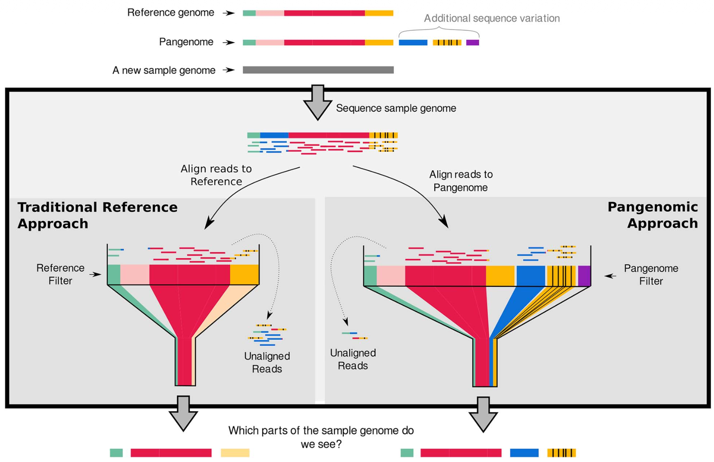
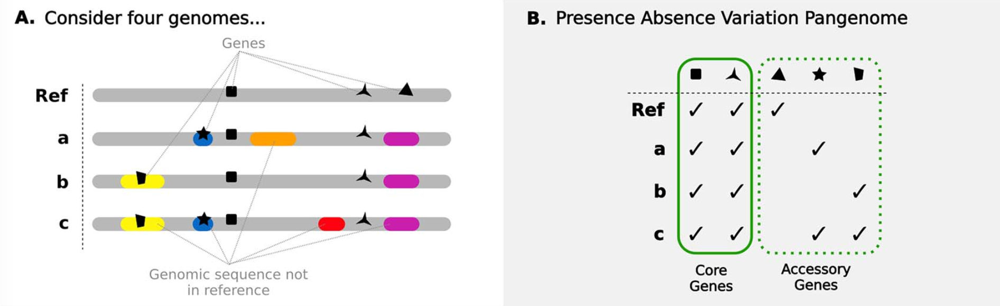
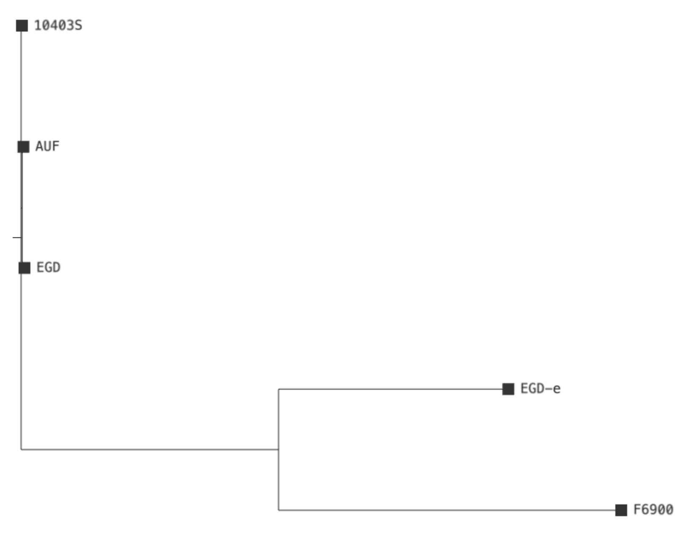

# Pangenomics

When the sequencing era truly began in the 1970s with the establishment of Sanger sequencing, it laid the foundation for the Human Genome Project, which in turn led to the human reference genome used widely today.

In traditional bioinformatic workflows, a single, linear reference genome (like the human reference genome) is dominantly used as the standard approach for comparative genomics. While this has driven great advancements in genetics, it suffers from a fundamental limitation known as reference bias (). Because a single reference genome only represents the genetic assembly of one individual (or a mosaic of a few), it fails to capture the broader genetic profile of an entire species. Consequently, structural variations or novel sequences present in other strains are often misaligned, unaligned, or completely discarded during mapping (). Therefore, linear reference genomes are insufficient to represent true genetic diversity.

To overcome this, pangenomes can be used. The field of Pangenomics is an approach that captures the natural genomic variation within a species far better than a single linear reference genome (). Ideally, it represents the entire genomic repertoire of a species. By capturing all of this information, the pangenomic approach aims to eliminate reference bias, ensuring that no genetic information is ignored during mapping simply because it does not exist in a single reference assembly (see Figure 1).

<figure style="text-align: center;">
  
  <figcaption>
    <strong>Figure 1: Comparison of a pangenome approach with a traditional reference approach</strong> (). With a traditional reference approach, any sample reads that cannot be mapped to the reference are discarded. A pangenomic approach solves this limitation by capturing a wider range of genetic diversity. This allows a higher percentage of sample reads to map, meaning more of the actual sample genome can be used for downstream analysis.
  </figcaption>
</figure>

The concept of a pangenome is not brand new. However, when the term "Pangenome" was born, it was simply not financially or computationally feasible to pursue it further. "Pangenome" was first used by  to describe a database of genomic and transcriptomic alterations found in tumor cells versus normal cells.  also brought the concept of pangenomics into the spotlight while sequencing multiple strains of Group B Streptococcus (GBS) to help develop a vaccine. During this process, they noticed that with every new strain they sequenced, they kept finding new genes that did not exist in any of the previously sequenced strains. They realized that a single reference genome could never capture the entire genetic diversity of a species. If they had used the first sequenced strain as their sole reference, all the novel genes from the new strains would have been unmapped and discarded during analysis.

With the advent of Next-Generation Sequencing technologies around 2010, sequencing became significantly faster and more affordable. Today, the reduced sequencing costs, combined with increased computational resources compared to the early 2000s, make it possible to properly realize true pangenomes. This technological leap led to the release of the first human pangenome draft in 2023 ().

According to , there exist three major types of pangenomes. Here we focus on the **Presence-Absence Variation Pangenome** (see Figure 2) that was originally introduced by  and whose description has been expanded by others over the years. This consists of:
- The **Core Genome**: Set of genes shared by all individuals of a species. This is sometimes strictly defined as 100% presence, or more loosely as a "**soft-core**" with 95% or 99% presence.
- And the **Accessory Genome**: Set of genes present in only a subset of individuals. This is further divided into
  - **Shell Genome**: Set of genes present in 1% to 99% of individuals 
  - and the **Cloud Genome**: Set of genes present in less than 1%.

<figure style="text-align: center;">
  
  <figcaption>
    <strong>Figure 2: A Presence-Absence Variation Pangenome</strong> (Modified after ). (A) A comparative genomic analysis of four related sequences is shown, utilizing one reference genome alongside three variants from the same population. Genetic variations from the reference are highlighted in color, and specific genes are denoted by black shapes. (B) The total pool of genes is divided into two distinct groups in a Presence-Absence Variation Pangenome: the core genes and accessory genes.
  </figcaption>
</figure>

> <agenda-title></agenda-title>
>
> In this tutorial, you will apply the pangenomic approach to your own data. You are going to analyze five *Listeria monocytogenes* strains by first annotating their genomes with Prokka. Afterward, you will build a Presence-Absence Variation Pangenome using Roary to identify the core genes and the accessory genes. To finish, you will use IQ-TREE on the core genes to construct a phylogenetic tree, showing how these five strains are evolutionarily related.
>
> 1. TOC
> {:toc}
>
{: .agenda}

# Data upload

To identify core and accessory genes across multiple bacterial strains, you will need the genome sequences in FASTA format of each strain.

> <hands-on-title>Data upload</hands-on-title>
>
> 1. Create a new history for this tutorial. Give it a name like `Pangenome Analysis`.
>
>    
>
>    
>
> 2.  the following files from [Zenodo](https://doi.org/10.5281/zenodo.21339040).
>
>    ```
>    https://zenodo.org/records/21339041/files/10403S.fasta
>    https://zenodo.org/records/21339041/files/AUF.fasta
>    https://zenodo.org/records/21339041/files/EGD-e.fna
>    https://zenodo.org/records/21339041/files/EGD.fasta
>    https://zenodo.org/records/21339041/files/F6900.fna
>    ```
>
>    
>
> 3. Create a dataset collection containing the uploaded FASTA files. Give it a name like `Assemblies`.
>
>    
>
{: .hands_on}

# Annotate the Strains with Prokka

You will use Prokka to annotate all bacterial strains simultaneously using the dataset collection. Prokka will scan the DNA sequences to locate genomic features, such as genes, and assign them their names and biological functions.

> <hands-on-title>Annotate Strains</hands-on-title>
>
> 1. Select `Tools` in the left sidebar and search for  in the list that appears. Select it to open the tool. 
>
> 2. Within Prokka, select the following parameters (leave everything else unchanged):
>    -  *"Contigs to annotate"*: Click on the *"Dataset collection"* icon and select your `Assemblies` dataset collection
>    - *"Genus name"*: Enter `Listeria`
>    - *"Species name"*: Enter `monocytogenes` 
>    - *"Additional outputs"*: Deselect all options except `Annotation in GFF3 format, containing both sequences and annotations (.gff)`
>   
> 3. Run the tool. 
>
{: .hands_on}

## Examine the Output

Once Prokka has finished, two new dataset collections will appear in your history:

- One containing the GFF3 output files for each strain. This is the dataset collection you will use further on. Take a look at each output file in this collection.
- One containing the logs of each run.

> <details-title>What is a GFF3 file?</details-title>
>
> **GFF3** stands for **General Feature Format (version 3)**. It is a plain text file used in bioinformatics to describe the exact locations of genomic features. The file contains 9 tab-separated columns that provide information for each feature ([official specification](http://www.sequenceontology.org/gff3.shtml)).
>
> Standard GFF3 files only contain the coordinates of genomic features. However, Prokka attaches the raw DNA sequence in FASTA format at the bottom of the GFF3 file (starting with a ##FASTA line in the file). This is exactly what the next tool requires to build the pangenome.
>
{: .details}

# Calculate the Pangenome with Roary

Now you will run Roary to compare the genes identified across all strains by Prokka. Roary will cluster the genes based on their sequence similarity to construct the pangenome by identifying the core genes and the accessory genes.

> <hands-on-title>Identify Core and Accessory Genes</hands-on-title>
>
> 1. Select `Tools` in the left sidebar and search for  in the list that appears. Select it to open the tool. 
>
> 2. Within Roary, select the following parameters (leave everything else unchanged):
>    - *"Individual gff files or a dataset collection"*: Select `Collection` in the dropdown
>      -  *"Dataset collection to submit to Roary"*: Select the collection containing the GFF3 output files from the previous step.
>    - *"Additional outputs"*: Tick `Accessory binary genes in newick format`
>   
> 3. Run the tool. 
>
{: .hands_on}

## Examine the Output

Once Roary has finished, four different output files will appear in your history. Take a look at each output file:

-  **Summary statistics** file: Gives you a quick overview of how many genes belong to the core genome and the accessory genome.
-  **Gene Presence Absence** file: Shows which genes are found in which strains. 
-  **Core Gene Alignment** file: Contains the aligned sequences of the core genes in FASTA format.
-  **Accessory Binary Genes (Newick)** file: Contains a phylogenetic tree based on the presence and absence of the accessory genes.

> <question-title></question-title>
>
> 1. How many genes are in the pangenome in total and how many of them are shell genes?
> 2. In which strains can the gene for the Putative Cyclic di-GMP Phosphodiesterase *PdeC* be found?
>
> > <solution-title></solution-title>
> >
> > 1. There are 3417 genes in total in the pangenome and, of these, 829 are shell genes. You can see this by viewing the  **Summary statistics** file. You will see that Roary defines the shell genome as a set of genes present in 15% to 95% of individuals and the cloud genome as a set of genes present in less than 15% of individuals.
> > 2. *PdeC* can be found in all five strains: *10403S*, *AUF*, *EGD*, *F6900*, and *EGD-e*. You can see this by viewing the  **Gene Presence Absence** file. Each row corresponds to an annotated gene and provides information on how many isolates contain it. At the very end of the row, you can identify the specific strains by the presence of their locus tags. For the full view of the file, you may need to download the file and view it on your computer.
> >
> {: .solution}
>
{: .question}

# Construct the Phylogenetic Tree with IQ-TREE

You can now use the  **Core Gene Alignment** file to build a phylogenetic tree from it. This will show you the evolutionary relationship between all strains based on their shared genetic backbone. For this, you will use **IQ-TREE**.

> <hands-on-title>Build a phylogenetic tree</hands-on-title>
>
> 1. Select `Tools` in the left sidebar and search for  in the list that appears. Select it to open the tool. 
>
> 2. Within IQ-TREE, select the following parameters (leave everything else unchanged):
>    -  *"Specify input alignment file in PHYLIP, FASTA, NEXUS, CLUSTAL or MSF format."*: Select the `Core Gene Alignment` file
>
> 3. Run the tool. 
>
{: .hands_on}

## Examine the Output

Once IQ-TREE has finished, five different output files will appear in your history:

-  **BIONJ Tree** file: This is an initial draft tree.
-  **MaxLikelihood Tree** file: Your main result. It contains the final phylogenetic tree in Newick format.
-  **MaxLikelihood Distance Matrix** file: Shows the calculated evolutionary distance between every possible pair of your strains.
-  **Occurrence Frequencies in Bootstrap Trees** file: Contains the statistical support for the tree's branches.
-  **Report and Final Tree** file: A summary of the entire run and a text-based visual of the tree.

## Visualize the Phylogenetic Tree

Now that you have a phylogenetic tree from your bacterial strains, you can view it visually. 

> <hands-on-title>Visualize the Phylogenetic Tree</hands-on-title>
>
> 1. Select the  **MaxLikelihood Tree** file in your history and click the  **View** icon.
>
> 2. By default, the file is displayed in  **Preview** mode. In the top tab bar, select  **Visualize**. 
>
> 3. Select the `Phylogenetic Tree Browser`
>
{: .hands_on}

You should see a phylogenetic tree like in Figure 3. Zoom in to look at each branch.

<figure style="text-align: center;">
  
  <figcaption>
    <strong>Figure 3: Phylogenetic tree of the five analyzed bacterial strains based on the core genome.</strong> Visualization of the evolutionary relationship and genetic divergence among the selected strains. The topology reveals two distinct groupings: (A) Strains 10403S, AUF, and EGD cluster closely together (their short branch lengths confirm that they share a near-identical core genome), and (B) Strains F6900 and EGD-e, which branch off into a separate cluster. This demonstrates a higher genetic distance and evolutionary divergence, both from the first group and from one another.
  </figcaption>
</figure>

> <comment-title>What can we deduce from these results?</comment-title>
>
> - Strains that appear highly similar in this tree might have completely different traits in reality. This is because variations can exist within their accessory genes.
> - For example, one strain might carry plasmids with antibiotic resistance, while another might harbor toxin genes introduced by phages.
> - These differences are hidden in this specific phylogenetic tree because it was built on core genes.
> - A core genome tree is precise for tracing evolutionary descent and relatedness, but it does not reveal the complete individual genetic repertoire.
{: .comment}

# Conclusion
This tutorial provided a step-by-step guide on how to construct a bacterial Presence-Absence Variation Pangenome by annotating the genomes with Prokka and extracting the core and accessory genes with Roary. Additionally, it provided a guide for creating a phylogenetic tree with IQ-TREE based on the core genes. By following these steps, you should be able to identify core and accessory genes, and uncover the evolutionary relationships among your own bacterial strains.