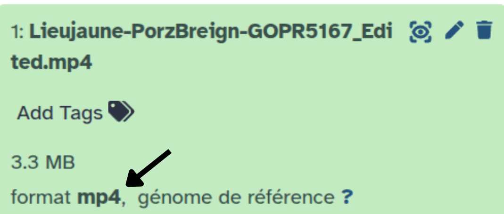
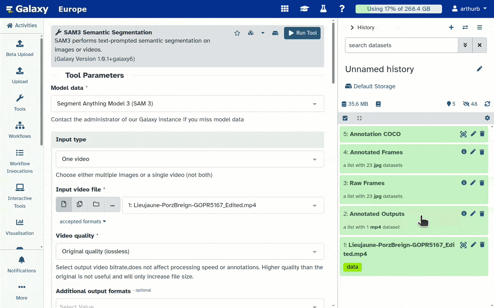
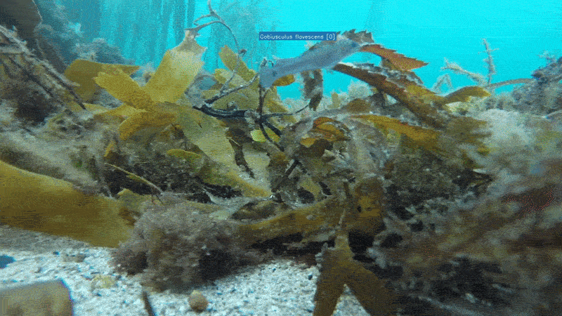

In this tutorial, we will explore a complete pipeline for annotating images and videos of marine species. As an example, we will use a video from the [Moorev](https://moorev.fr/) project, cut into a short clip and available on Zenodo.

This pipeline has two main steps:
1. **Automatic annotation** using a text prompt with 
2. **Correction and validation** of the annotations with 

> <details-title>Learn more about the MOOREV project</details-title>
>
> **MOOREV**: Microclimates and observation tools for the responses of marine life on the seafloor
>
> **Observing interactions between marine species facing microclimatic gradients on the shore**
>
> The MOOREV project is led by Nadine Le Bris (Sorbonne University, Concarneau Marine Station),
> with support from the National Museum of Natural History, the CNRS, and the Fondation de France.
> It started in 2022. Its goal is to better understand, and help others understand, the effects of
> climate disturbance on coastal biodiversity.
>
> The project uses underwater imaging methods to observe benthic species at the individual level,
> across different shore habitats. Groups of school students repeat data collection at their study
> sites, which are labelled by the Educational Marine Areas program of the French Biodiversity
> Office, across tide cycles, seasons, and years.
>
> The project brings together researchers and environmental education professionals. It is
> co-built with school classes and their teachers, using the shore as a natural laboratory. In the
> long term, it aims to support protection and conservation measures, taking into account the links
> between climate change and marine socio-ecosystems.
>
{: .details}

> <agenda-title>In this tutorial, we will cover:</agenda-title>
>
> 1. TOC
> {:toc}
>
{: .agenda}

# Loading the data

The video used in this tutorial is a short clip taken directly from the Moorev project, available on Zenodo. This clip was chosen because it shows most of the features of the tools presented here.

> <hands-on-title>Load the video into Galaxy</hands-on-title>
>
> 1. Create a new history for this tutorial (for example: "Annotation Moorev")
>
>    
>
>    
>
> 2. Import the file from [Zenodo]({{ page.zenodo_link }}):
>
>    ```
>    https://zenodo.org/records/20639741/files/Lieujaune-PorzBreign-GOPR5167_Edited.mp4?download=1
>    ```
>
>    
>
> 3. Check that the file is shown in **green** in the history before you continue
>
> 4. Check the datatype
>
>    > <tip-title>Check the datatype</tip-title>
>    >
>    > Galaxy assigns the datatype automatically. Since most tools use it to filter their inputs, it is important to make sure it is correct. In our case, check that the type is `mp4`. If it is not, the import may have had an error, and you can change the type manually.
>    >
>    > {: style="width:75%; display:block; margin:auto;"}
>    >
>    > 
>    >
>    {: .tip}
{: .hands_on}

# Automatic annotation with SAM3

SAM3 is a text-guided segmentation model. It automatically detects and segments objects that match your prompt, with no need for previous annotations.

> <tip-title>A dedicated SAM3 tutorial exists</tip-title>
>
> If you want to learn more about SAM3 and its parameters, check out the dedicated tutorial:
> [SAM3 Tutorial]()
>
{: .tip}

> <hands-on-title>Setting up SAM3</hands-on-title>
>
> 1.  with these parameters:
>
>    -  *"Model data"*: `Segment Anything Model 3 (SAM 3)` (default)
>    -  *"Input type"*: `One video`
>        -  *"Input video file"*: `1: Lieujaune-PorzBreign-GOPR5167_Edited.mp4`
>        -  *"Video quality"*: `Original quality (lossless)` (default)
>        -  *"Additional output formats"*: `Empty` (default)
>        -  *"Export individual frames"*: `Both annoted and raw frames`
>    -  *"Text prompt"*: `fish`
>    -  *"Confidence threshold"*: `0.5`
>    -  *"Video frame stride"*: `5`
>    -  *"Show bounding boxes on annotated output"*: `Yes`
>    -   *"Inference image size"*: `644 (default, balanced)` (default)
>    -  *"Normalize outputs?"*: `No` (default)
>    -  *"Normalize outputs?"*: `No` (default)
>
> 2. Click **Run Tool**
>
>    > <comment-title>Processing time</comment-title>
>    >
>    > Processing can take several minutes, depending on the length of the video and the server resources. Wait until the outputs turn green in the history.
>    >
>    {: .comment}
>
> 3. Once it is finished, you will have these items in your history:
>    - **5: Annotation COCO**: `annotations.json` — the segmentation masks in COCO format
>    - **4: Annotated Frames**: the collection of extracted images (annotated)
>    - **3: Raw Frames**: the collection of extracted images (not annotated)
>    - **2: COCO Extracted Frames**: the annotated video, for visual checking
>
> 4. Check the results visually by clicking  on **Annotated Outputs**
>
>    {: style="width:75%; display:block; margin:auto;"}
>
>    > <comment-title>Limits of SAM3</comment-title>
>    >
>    > As you can see, not all annotations are perfect. False positives are the most common problem. This is why the next step, correction and validation, is essential.
>    >
>    {: .comment}
>
{: .hands_on}

# Correcting and validating the annotations

We will now see how to correct the annotations with **Edit COCO Annotation**, and then check the result with **COCO Annotation Visualizer**.

## Correcting with Edit COCO Annotation

The **Edit COCO Annotation** tool lets you modify COCO annotations without opening the images. It has three modes:

- **Keep**: keep only the listed IDs (remove all the others) — useful when only a few IDs need to be kept; it can also rename them
- **Remove**: remove only the listed IDs
- **Rename**: rename the listed IDs without removing any others

> <hands-on-title>Keep, remove, or rename annotations</hands-on-title>
>
> 1.  with these parameters:
>
>    -  *"COCO annotation file"*: `5: Annotation COCO `
>        -  *"1: Track to keep"*
>            -  *"Track IDs"*: `0,4-6`
>            -  *"Rename"*: `Gobiusculus flavescens`
>            -  *"Frame min"*: `Empty` (default)
>            -  *"Frame max"*: `Empty` (default)
>        -  *"2: Track to keep"*
>            -  *"Track IDs"*: `2`
>            -  *"Rename"*: `Crenilabre`
>            -  *"Frame min"*: `Empty` (default)
>            -  *"Frame max"*: `Empty` (default)
>        -  *"Frame max"*: `Empty` (default)
>
>    > <comment-title>The same result in two steps</comment-title>
>    >
>    > You can also get the same result in two steps: use **Remove** to remove IDs 1 and 3, then use **Rename** to rename the remaining groups.
>    >
>    > Note: SAM3 can sometimes give the same Track ID to two different objects at different moments in the video. This is why the **Frame min** and **Frame max** parameters were added.
>    >
>    {: .comment}
>
> 2. Once it is finished, you will have this item in your history:
>    - **54: Edited COCO annotations**: the JSON file in COCO format, modified with the parameters set above
>
{: .hands_on}

### Visualizing the annotations with COCO Annotation Visualizer

This tool lets you easily visualize a JSON file in COCO format, shown on top of a video or images. Here we use it to check our annotations after correction.

> <hands-on-title>Visualize the COCO annotations</hands-on-title>
>
> 1.  with these parameters:
>
>        -  *"Input video file"*: `1: Lieujaune-PorzBreign-GOPR5167_Edited.mp4`
>        -  *"Frame stride"*: `5`
>    -  *"Frame stride"*: `5`
>    -  *"COCO annotation file"*: `54: Edited COCO annotations`
>    -  *"Filter categories"*: `Empty` (default)
>    - In *"Display options"*:
>        -  *"Show bounding boxes"*: `No`
>        -  *"Show segmentation masks"*: `Yes` (default)
>        -  *"Show category labels"*: `Yes` (default)
>        -  *"Show annotation count"*: `No` (default)
>        -  *"Mask opacity"*: `0.4` (default)
>        -  *"Bounding box thickness"*: `2` (default)
>        -  *"Label font scale"*: `0.6` (default)
>        -  *"Color mode"*: `Per instance (different color for each annotation)`
>        -  *"Output image format"*: `PNG (lossless)` (default)
>        -  *"Video frame rate (FPS)"*: `5.0`
>    -  *"Video frame rate (FPS)"*: `5.0`
>    -  *"Annotated frames only"*: `Yes` (default)
>
> 2. Once it is finished, you will have these items in your history:
>    - **56: Annoted video**: the annotated video
>    - **55: Annotated images**: each annotated frame
>
>    {: style="width:65%; display:block; margin:auto;"}
{: .hands_on}

# Conclusion

You now know how to use this complete pipeline to annotate videos of marine species:

- **SAM3** automatically generates annotations from a simple text prompt
- **Edit COCO** lets you quickly clean up annotations by keeping, removing, or renaming track IDs
- **COCO Annotation Visualizer** lets you visually check the results at each step

This pipeline can be reused for other species or other marine imaging projects — you just need to adapt the prompt and the SAM3 confidence settings.
