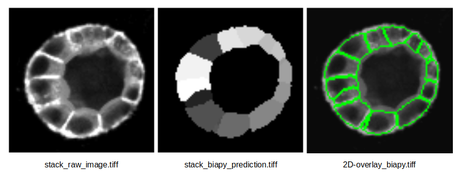
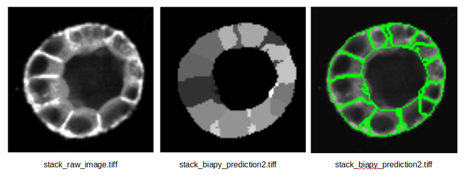

The application of supervised and unsupervised **Deep Learning (DL)** methods in bioimage analysis have been constantly increasing in biomedical 
researcg in the last decades. DL algorithms allow automatically classifying complex biological structures by learning complex patterns and features directly from large-scale imaging data, medical scans, or high-throughput biological datasets. Furthermore, trained models can be easily
share on online repositories [(BioImage.IO)](https://bioimage.io/#/models) to be reused by other scientists and support open science. 

However, running DL models often require high-level programming skills which can be often be a barrier to general audience especially the 
one without a proper computation background. Additionally, many DL models require GPU acceleration, which is not always accessible to all researchers. 
Such obstacoles might the practical and routine adoption of DL models in bioimaging. 

*So, how to make DL models accessible to a larger audience?* Well, [BiaPy](https://biapy.readthedocs.io/en/latest/) is an open source library and application that streamlines the use of common deep-learning workflows for a large variety of bioimage analysis tasks, including 2D and 3D semantic segmentation, instance segmentation, object detection, image denoising, single image super-resolution, self-supervised learning (for model pretraining), image classification and image-to-image translation. 

In this training, you will learn how to execute a BiaPy worflow directly in Galaxy. In particular, we will run [inference](https://en.wikipedia.org/wiki/Deep_learning) on a set of images using two pre-trained models from BioImage.IO defined in a 
BiaPy configuration file. A BiaPy YAML configuration file includes information about the hardware to be used, such as the number of CPUs or GPUs, the specific task or workflow, the model to be used, optional hyperparameters, the optimizer, and the paths for loading and storing data. 

For this training we will use two configuration file with two different models from BioImage.IO.

Said so... Let's start!

> <agenda-title></agenda-title>
>
> In this tutorial, we will deal with:
>
> 1. TOC
> {:toc}
>
{: .agenda}

## Getting images and the BiaPy YAML configuration file

The dataset required for this tutorial is available from [Zenodo]({{ page.zenodo_link }}). The CartoCell dataset containts whole epithelial cysts acquired at low resolution with minimal human intervention ([more information]({{ page.zenodo_link }})). The dataset is divided test, train and validation data each folder containg images and associated masks.

In order to simplify the data upload, we already prepared the test images and YAML files in the **Data Library** which is easy to be accessed on the left pannel in 
Galaxy.



## Run inference using a pre-trained model

Now we can set up the BiaPy tool with the [venoumus-swam model](https://bioimage.io/#/artifacts/venomous-swan)

> <hands-on-title>Configure the BiaPy Tool for Venoumus-Swam</hands-on-title>
>
> 1.  with the following parameters to extract metadata from the image:
>
>- *Do you have a configuration file?* : `Yes, I have one and I want to run BiaPy directly`
>
>- *Select a configuration file*: `conf_cartocell_model1.yaml`
>
>- *Specify the test raw images*: `01_raw_image.tiff` and `03_raw_image.tiff`
>
>- *Specify the test ground truth/target images*: `01_raw_mask.tiff` and `03_raw_mask.tiff`
>
>- On *Select output* check the boxes:
>     - [x]  `Test predictions (if exist)`
>     - [x]  `Post-processed test predictions (if exist)` 
>     - [x]  `Evaluation metrics (if exist, on test data)`
{: .hands_on}

Once the tool finish its run yuo will have three different dataset created in your history:

**Test predictions**

Full-size output images produced by the model on the test set. Because the model predicts small, overlapping patches, these patch outputs are merged back together to form one prediction per original image.

**Post-Processed Test Prediction**

Test predictions after automatic “clean-up” steps defined in the configuration. These steps can refine the raw output (for example, removing small spurious regions or separating touching objects). In this tutorial, Voronoi tessellation is applied to help split instances.

**Test metrics**

Numerical scores that measure how well the predictions match the ground truth (if provided). In instance segmentation, the report typically includes:

- IoU per output channel (how well pixel regions overlap), and

- Matching metrics (how well individual predicted objects match true objects), shown for raw predictions and post-processed predictions.

...but you can find more info in [BiaPy documentation](https://biapy.readthedocs.io/en/latest/)!

## Visualize the segmentation results

As first step, we can visualize one slice of the segmentation on the original image.

> <hands-on-title>Extract the results from the BiaPy output</hands-on-title>
>
> 1.  with the following parameters:
>- Input List: '"Build a workflow with BiaPy on dataset 2, 3, and others: Post-processed test predictions"'
>- How should a dataset be selected?:
>     - Select by Index
>         - Element index: `1`
>
> 2. Rename  the dataset to `biapy_prediction.tiff`
>
> 3.  with the following parameters:
>    -  *"Input Image"*: `biapy_prediction.tiff`
>    - *"Extract series"*: `All series`
>    - *"Extract timepoint"*: `All timepoints`
>    - *"Extract channel"*: `All channels`
>    - *"Extract z-slice"*: `Extract z-slice`
>        - *"Z-slice id"* `22`
>    - *"Extract range"*: `All images`
>    - *"Extract crop"*: `Full image`
>    - *"Tile image"*: `No tiling`
>    - *"Pyramid image"*: `No Pyramid`
>
> 4. Rename  the dataset to `stack_biapy_prediction.tiff`
>
> 5.  with the following parameters:
>    -  *"Input Image"*: `01_raw_image.tiff`
>    - *"Extract series"*: `All series`
>    - *"Extract timepoint"*: `All timepoints`
>    - *"Extract channel"*: `All channels`
>    - *"Extract z-slice"*: `Extract z-slice`
>        - *"Z-slice id"* `22`
>    - *"Extract range"*: `All images`
>    - *"Extract crop"*: `Full image`
>    - *"Tile image"*: `No tiling`
>    - *"Pyramid image"*: `No Pyramid`
>
> 6. Rename  the dataset to `stack_raw_image.tiff`
>
> 7.  with the following parameters to convert the image to PNG:
>    - *"Type of the overlay"*: `Segmentation contours over image`
>    -  *"Intensity image"*: `stack_raw_image.tiff` file
>    -  *"Label map"*: `stack_biapy_prediction.tiff` file (output of )
>    - *"Contour thickness"*: `1`
>    - *"Contour color"*: `green`
>    - *"Show labels"*: `no`
>8. Rename  the dataset to `2D-overlay_biapy.tiff`
{: .hands_on}

The segmentation results for the 20th z-stack are shown below:

{: width="50%"}

We can also do better and visualize the full 3D segmentation using the [LibCarna](https://github.com/kostrykin/LibCarna) tool in Galaxy!

> <hands-on-title>Visual 3D</hands-on-title>
>
> 1.  with the following parameters:
>    -  *"Input image (3-D)"*: Output of 
>    - *"Unit of the intensity values"*: `No unit`
>    - *"Rendering mode"*: `Maximum Intensity Projection (MIP)`
>    - *"Color map"*: `gist_gray`
>    - *"Camera parameters"*:
>      - *"Distance"*: `150`
>    - *"Video parameters"*:
>      - *"Frames"*: `400`
{: .hands_on}

<video loop="true" autoplay="autoplay" muted width="100%">
    <source src="../../images/biapy/carto_segm.mp4" type="video/mp4"/>
</video>

Pretty cool, eh?

## Compare different pre-trained models 

Lets now run the BiaPy tool again but this time with the [merry-water-buffalo](https://bioimage.io/#/artifacts/merry-water-buffalo) model:

> <hands-on-title>Configure the BiaPy Tool for Merry-Water-Buffalo</hands-on-title>
>
> 1.  with the following parameters to extract metadata from the image:
>
>- *Do you have a configuration file?* : `Yes, I have one and I want to run BiaPy directly`
>
>- *Select a configuration file*: `conf_cartocell_model2.yaml`
>
>- *Specify the test raw images*: `01_raw_image.tiff` and `03_raw_image.tiff`
>
>- *Specify the test ground truth/target images*: `01_raw_mask.tiff` and `03_raw_mask.tiff`
>
>- On *Select output* check the boxes:
>     - [x]  `Test predictions (if exist)`
>     - [x]  `Post-processed test predictions (if exist)` 
>     - [x]  `Evaluation metrics (if exist, on test data)`
{: .hands_on}

We can visualize again the results using the previous approach:

{: width="50%"}

But the **Evaluation Metrics** will give us a better overview on which model is performing better! 

For instance segmentation, evaluation is done by matching predicted objects to true (ground-truth) objects using an overlap rule.

**Venoumus-swam** struggles mainly with missing objects (low recall)

At IoU ≥ 0.5:

    Precision: 0.328
    Recall: 0.171
    F1: 0.222
    PQ: 0.157

**Water-buffalo** is clearly stronger at instance detection and segmentation

At a commonly used matching threshold (IoU ≥ 0.5), averaged across the 2 test images:

    Precision: 0.761
    Recall: 0.631
    F1: 0.689
    PQ: 0.473

So **Water-buffalo** is better both in:

- finding objects (higher recall), and
- keeping predictions correct (higher precision).

## Conclusions

Main conclusion is...