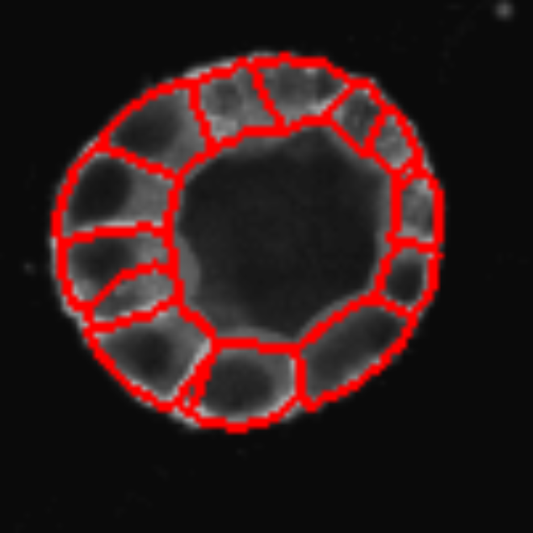

The application of supervised and unsupervised **Deep Learning (DL)** methods in bioimage analysis have been constantly increasing in biomedical 
researcg in the last decades. DL algorithms allow automatically classifying complex biological structures by learning complex patterns and features directly from large-scale imaging data, medical scans, or high-throughput biological datasets. Furthermore, trained models can be easily
share on online repositories [(BioImage.IO)](https://bioimage.io/#/models) to be reused by other scientists and support open science. 

However, running DL models often require high-level programming skills which can be often be a barrier to general audience especially the 
one without a proper computation background. Additionally, many DL models require GPU acceleration, which is not always accessible to all researchers. 
Such obstacoles might the practical and routine adoption of DL models in bioimaging. *How to make DL models accessible to a larger audience?* Well, [BiaPy](https://biapy.readthedocs.io/en/latest/) is an open source library and application that streamlines the use of common deep-learning workflows for a large variety of bioimage analysis tasks, including 2D and 3D semantic segmentation, instance segmentation, object detection, image denoising, single image super-resolution, self-supervised learning (for model pretraining), image classification and image-to-image translation. 

In this training, you will learn how to execute a BiaPy worflow directly in Galaxy. In particular, we will run [inference](https://en.wikipedia.org/wiki/Deep_learning) on a set of images using a pre-trained model from BioImage.IO.

Said so... Let's start!

> <agenda-title></agenda-title>
>
> In this tutorial, we will deal with:
>
> 1. TOC
> {:toc}
>
{: .agenda}

## Getting Data and the BiaPy YAML configuration file

The dataset required for this tutorial is available from [Zenodo]({{ page.zenodo_link }}). The CartoCell dataset containts whole epithelial cysts acquired at low resolution with minimal human intervention ([more information]({{ page.zenodo_link }})). The dataset is divided test, train and validation data each
folder containg images and associated masks.

A BiaPy YAML configuration file includes information about the hardware to be used, such as the number of CPUs or GPUs, the specific task or workflow, the model to be used, optional hyperparameters, the optimizer, and the paths for loading and storing data. For this training we will use two configuration file with two different models from BioImage.IO.

> <hands-on-title>Data upload using the ZIP explore function</hands-on-title>
>
> 1. If you are logged in, create a new history for this tutorial
>
>    
>
> 2. Import the following dataset from [Zenodo]({{ page.zenodo_link }}) or from the data library.
>    - **Important:** Choose the type of data as `zip`.
>
>    ```
>    {{ page.zenodo_link }}/files/CartoCell.zip
>    ```
>
>    
>
>    
>
> 3.  with the following parameters:
>    -  *"input_file"*: `CartoCell.zip`
>    - *"Extract single file"*: `Single file`
>    - *"Filepath"*: `B2--W00026--P00001--Z00000--T00000--dapi.tif`
>
> 4. Rename  the dataset to `input.tiff`
>
>    
{: .hands_on}


## Run inference on a set of images using a pre-trained model

Now we can set up the BiaPy tool with the [venoumus-swam model](https://bioimage.io/#/artifacts/venomous-swan)

> <hands-on-title>Configure the BiaPy Tool</hands-on-title>
>
> 1.  with the following parameters to extract metadata from the image:

- *Do you have a configuration file?* : `Yes, I have one and I want to run BiaPy directly`

- *Select a configuration file*: `cartocell-venomous-swan.yaml`

- *Specify the test raw images*:

- *Specify the test ground truth/target images*:

- On *Select output* check the boxes:
  - [x]  `Test predictions (if exist)`
  - [x]  `Post-processed test predictions (if exist)` 
  - [x]  `Evaluation metrics (if exist, on test data)`

Once the tool finish its run yuo will have three different dataset created in your history:

- *Test Prediction*: **NEED EXPLANATIONS**
- *Post Processed Test Prediction*: **NEED EXPLANATIONS**
- *Test Metrics*: **NEED EXPLANATIONS**

## 2D and 3D results visualization

As first step we can try to visualize one slice of the segmentation on the original image.

To do so:

> 1.  with the following parameters:
- Input List: "Build a workflow with BiaPy on dataset 2, 3, and others: Post-processed test predictions"
- How should a dataset be selected?:
  - Select by Index
  - Element index: 1

> 2.  with the following parameters:
**THIS FOR THE MASK**
> 3.  with the following parameters:
 **THIS FOR THE IMAGE**
 > 3.  with the following parameters:


The segmentation results for the 20th z-stack are shown below:



However, we can also do better and visualize the full 3D segmentation using the [LibCarna](https://github.com/kostrykin/LibCarna) tool in Galaxy!

> 1.  with the following parameters:

## Compare different pre-trained models 

Lets now run the BiaPy tool again but this time with the [merry-water-buffalo](https://bioimage.io/#/artifacts/merry-water-buffalo) model:

> <hands-on-title>Configure the BiaPy Tool</hands-on-title>
>
> 1.  with the following parameters to extract metadata from the image:

- *Do you have a configuration file?* : `Yes, I have one and I want to run BiaPy directly`

- *Select a configuration file*: `merry-water-buffalo.yaml`

- *Specify the test raw images*:

- *Specify the test ground truth/target images*:

- On *Select output* check the boxes:
  - [x]  `Test predictions (if exist)`
  - [x]  `Post-processed test predictions (if exist)` 
  - [x]  `Evaluation metrics (if exist, on test data)`

We can now visualize the results and compare images and metrics.

According to xxx, the model xxx is performing better than xxx

## Conclusions

Main conclusion is...