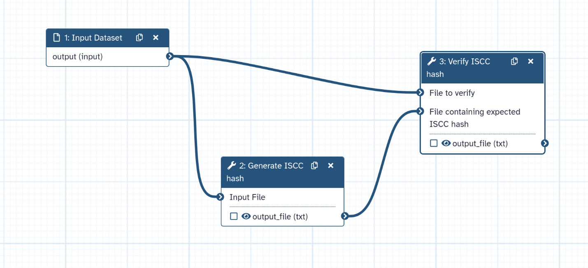
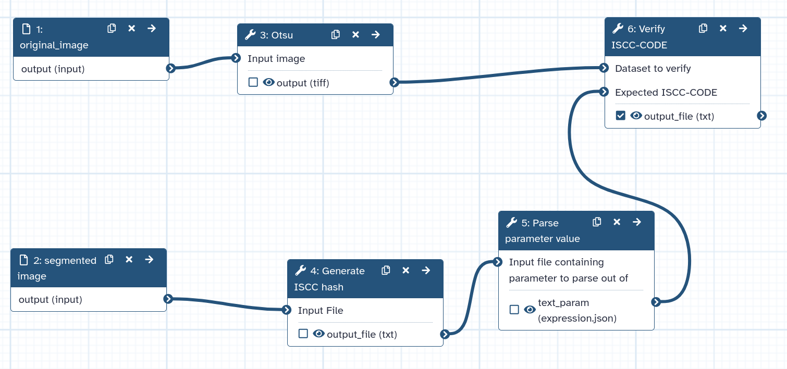

# File content and integrity validation with International Standard Content Code (ISCC)

In scientific workflows, ensuring data integrity and tracking modifications to data content is crucial for reproducibility. Traditional checksums (like MD5 or SHA) can verify if files are identical, but they cannot detect similar content or survive format conversions.

The **International Standard Content Code (ISCC)** is a content-derived identifier that provides both:
- **Identity verification**: Checksum functionality to verify exact file matches
- **Similarity detection**: Ability to detect similar content even across different file formats

The **Galaxy ISCC-suite** allows you to integrate content tracking into any Galaxy workflow, providing quality control and provenance tracking for your data analysis pipelines.

## ISCC Code structure

An ISCC-SUM code is a 55-character identifier with two main components, which are combined into one code:

- **Data-Code**: Content-based hash that allows similarity comparison
- **Instance-Code**: A fast checksum or cryptographic hash

The Instance-Code uses BLAKE3 hashing, truncated to 64 bits by default. For applications requiring cryptographic-strength verification, ISCC-SUM can output the full 256-bit hash.

For example the ISCC hash for this file [`example_image.tiff`](workflows/test-data/example_image.tiff):
```
ISCC:K4AI45QGX6J3LYNEHONZMQT2GJ6YPJDS74EIC2YMSORF4S5H5SKHQQI
```
Which is composed of the **Data-Code** and **Instance-Code** hashes.
``` 
    ISCC:GADY45QGX6J3LYNEHONZMQT2GJ6YPZ4BXJQ7ZHWZ7EHRLKANDCSACWI
    ISCC:IAD2I4X7BCAWWDETUJPEXJ7MSR4EDZCTTBQS6LQQDWDHS6T4KDDPZ5A
```
Files with similar content will have similar Data-Code components, but their Instance-Code will be different. Hence the Instance-Code allows to verify file integrity.

> <agenda-title></agenda-title>
>
> In this tutorial, we will deal with:
>
> 1. TOC
> {:toc}
>
{: .agenda}


# Prepare your data

For this tutorial, we'll use a simple dataset with microscope images that demonstrate different use cases. However, the ISCC SUM tools can ben used for any type of digital content.

## Get the data

> <hands-on-title>Data Upload</hands-on-title>
>
> 1. Create a new history for this tutorial in Galaxy.
>
>    
>
> 2. Download the following image and import it into your Galaxy history.
>    - [`example_image.tiff`](workflows/test-data/example_image.tiff)
>    - [`example_image2.tiff`](workflows/test-data/example_image2.tiff)
>    - [`example_image3.tiff`](workflows/test-data/example_image3.tiff)
>    - [`example_thresholded1.tiff`](workflows/test-data/example_thresholded1.tiff)
>    
>    If you are importing the image via URL:
>
>    
> 
{: .hands_on}

# Generate ISCC codes

The first step is generating ISCC codes for your input files. This creates a content fingerprint that can be used throughout your workflow.

> <hands-on-title>Generate ISCC codes for input files</hands-on-title>
>
> 1.  with the following parameters:
>    -  *"Input File"*: Select the first example image (`example_image.tiff`.)
>  
>    Run the tool. This will generate a 55-character ISCC code for the file.
>
> 2. Inspect the output by clicking on the dataset.
>    
>    You should see a single line containing the ISCC code in the output. For the first example image the code is expected to be:
> ```
> K4AI45QGX6J3LYNEHONZMQT2GJ6YPJDS74EIC2YMSORF4S5H5SKHQQI 
> ```
> 3. Repeat for the other example images to generate another ISCC code for comparison.
>
{: .hands_on}

> <question-title></question-title>
>
> 1. Will the same file always generate the same ISCC code?
>
> > <solution-title></solution-title>
> >
> > 1. Yes! The same file will always generate the identical ISCC code, making it suitable for integrity verification.
> >
> {: .solution}
>
{: .question}

# Verify file integrity

During workflow execution, you may want to verify that intermediate files match expected content. The **Verify ISCC hash** tool allows you to check if a file matches a known ISCC code.

## Manual verification

> <hands-on-title>Verify a file against its ISCC code</hands-on-title>
>
> 1.  with the following parameters:
>    -  *"Dataset to verify"*: Select the first example image
>    - *"Expected ISCC-CODE"*: 
>        - *"Expected ISCC code"*: Paste the ISCC code you generated in the previous step
>
> 2. Check the verification report in the output.
>    
>    The report shows:
>    - Status: OK (match) or FAILED (mismatch)
>    - Expected ISCC code
>    - Generated ISCC code
{: .hands_on}

## Workflow integration

A powerful use case is integrating ISCC verification directly into your workflows. Here we'll build a simple verification workflow step by step.

### Step 1 - Define the workflow inputs

To make the workflow reusable, we need to define two inputs: the image to verify and a file containing the expected ISCC code.

> <hands-on-title>Create the workflow inputs</hands-on-title>
>
> 1. Create a new workflow in the workflow editor.
>
>    
>
> 2. Select  **Input dataset** from the list of tools:
>    -  **1: Input Dataset** appears in your workflow.
>    Change the "Label" of this input to *Input image*.
> 3. Add another  **Input dataset**:
>    -  **2: Input Dataset** appears in your workflow.
>    Change the "Label" of this input to *Expected ISCC code file*.
{: .hands_on}

### Step 2 - Parse the expected ISCC code

The *Generate ISCC-CODE* tool outputs the ISCC code as a text file, but the *Verify ISCC-CODE* tool expects the code as a parameter input. We use *Parse parameter value* to bridge this gap.

> <hands-on-title>Add the parameter parsing step</hands-on-title>
>
> 1. While in the workflow editor, add  **Parse parameter value** from the list of tools:
>    - Connect the output of  **2: Expected ISCC code file** to the "Input file containing parameter to parse" input of  **3: Parse parameter value**.
{: .hands_on}

### Step 3 - Add the verification step

Now we add the ISCC verification tool and connect all the inputs.

> <hands-on-title>Add the ISCC verification step</hands-on-title>
>
> 1. Add  from the list of tools:
>    - Connect the output of  **1: Input image** to the "Dataset to verify" input of  **4: Verify ISCC-CODE**.
>    - Connect the output of  **3: Parse parameter value** to the "File containing expected ISCC code" input of  **4: Verify ISCC-CODE**.
{: .hands_on}

When placing this verification step in a full workflow, it can help validate that your processing didn't unexpectedly alter the content.



## Image analysis workflow integration

This can be applied in an image analysis workflow to verify an image processing tool provides the expected reproducible output. In the example files we shared, a thresholded image `example_thresholded1.tiff` can be found. We will use it to verify whether the Otsu threshold result of this image can be reproduced.

> <hands-on-title>Image analysis verification workflow</hands-on-title>
>
> 1. Import and run the ready-to-use workflow:
>
>    
>
> 2. Provide the inputs:
>    - **Original image**: Select `example_image.tiff` - the image to be processed
>    - **Segmented image**: Select `example_thresholded1.tiff` - the reference segmentation to compare against
>
> 3. Run the workflow and inspect the verification output.
>
> The workflow performs Otsu thresholding on the original image and verifies whether the result matches the expected segmentation using ISCC codes. This allows you to verify whether the thresholding method is working as expected and the algorithm has not been altered (e.g., in a new version).
>
> 
{: .hands_on}

> <comment-title>When to use verification</comment-title>
>
> Verification is particularly useful:
> - After file transfers or storage operations
> - To confirm correct input files in complex workflows
> - As quality control checkpoints in processing pipelines
> - To detect unintended data modifications
{: .comment}

# Detect similar content

One of ISCC's unique features is detecting similar content, even across different formats. This is useful for finding duplicates, tracking content transformations, or identifying related files.

## Compare two files

> <hands-on-title>Compare two files for similarity</hands-on-title>
>
> 1.  with the following parameters:
>    - *"Input type"*: `Datasets to compare`
>        -  Select multiple datasets (or a collection, see below)
>    - *"Similarity threshold (Hamming distance)"*: `12` (default)
>
> 2. The tool will create tabular output which indicates which datasets are similar.
>    The table will list all the files that has been set as input. For the files which have a similar file, below the set threshold, the similar file is listed.

{: .hands_on}

## Find similar files in collections

When working with a collection of files, you can identify all similar items. This is particularly useful when you have large datasets and want to find duplicates or track how processing affects content similarity.

> <hands-on-title>Find similar files in a collection</hands-on-title>
>
> 1. Create a dataset collection with your test images
>
>    
>
>    Include all images from the tutorial: `example_image.tiff`, `example_image2.tiff`, `example_image3.tiff` and `example_thresholded1.tiff`
>
> 2.  with the following parameters:
>    - *"Input type"*: `Datasets to compare`
>        -  Select your collection
>    - *"Similarity threshold (Hamming distance)"*: `12` (default)
>
> 3. Examine the output table. Each row represents a file from your collection. The columns show:
>    - The filename
>    - Its ISCC code
>    - Any similar files found (with their similarity score)
>
>    Files that share content (like `example_image.tiff` and `example_image3.tiff`, which is slightly modified ) will be grouped together, although their ISCC-SUM codes are different.
>
>
>
>| file_id | filename | iscc_code | match_id | match_filename | match_iscc_code | distance |
>|---------|----------|-----------|----------|----------------|-----------------|----------|
>| 238219003 | example_image3.tiff |  K4AI45QXX6J3LYNEHONZMQD2GJ6YO4GFNFH7UPCBORVJW4FOABL2ZPY | 238219006 | >example_image.tiff | K4AI45QGX6J3LYNEHONZMQT2GJ6YPJDS74EIC2YMSORF4S5H5SKHQQI | 3 |
>| 238219006 | example_image.tiff | K4AI45QGX6J3LYNEHONZMQT2GJ6YPJDS74EIC2YMSORF4S5H5SKHQQI | 238219003 | >example_image3.tiff | K4AI45QXX6J3LYNEHONZMQD2GJ6YO4GFNFH7UPCBORVJW4FOABL2ZPY | 3 |
>| 238219004 | example_image2.tiff | K4AHJAICHVVDAB3C6LLJ5PJV6AON3JZUGFOTAAOELT5QTVGYELO55BA | | | | -1 |
>| 238219005 | example_thresholded1.tiff | K4AC3DH66DCNU22KNYVHQOFIMESNRZCZNEOAD3UVWNI6ZVHPWMMFWYI | | | | -1 |

{: .hands_on}

> <tip-title>Understanding the Hamming distance threshold</tip-title>
>
> Data-Code similarity reflects byte-level similarity, not semantic content. Interpreting whether observed differences are scientifically significant requires domain expertise. For the default 64-bit Data-Code, Hamming distance ranges from 0 to 64. A threshold of 12 represents approximately 19% bit difference. Lower values mean more similar content:
> - **0**: Identical Data-Code 
> - **1-12**: Very similar (default threshold)
> - **>12**: Increasingly different content
>
> Adjust the threshold based on your use case: lower values for stricter matching, higher values to catch more distant similarities.
{: .tip}


> <question-title></question-title>
>
> 1. Looking at the similarity results table, why do `example_image.tiff` and `example_image3.tiff` show a match while `example_thresholded1.tiff` does not?
>
> 2. What does a distance value of -1 indicate?
>
> > <solution-title></solution-title>
> >
> > 1. `example_image.tiff` and `example_image3.tiff` contain similar visual content, resulting in a Hamming distance of 5, which is below the threshold of 12. The thresholded image has undergone significant processing (binarization), changing its content substantially so it no longer matches the original within the similarity threshold.
> >
> > 2. A distance of -1 indicates that no similar file was found within the specified threshold. The file is unique compared to all other files in the collection.
> >
> {: .solution}
>
{: .question}


# Practical use cases

## Use case 1: Quality control in image analysis pipelines

When processing large microscopy datasets:

- Generate ISCC codes for raw images upon acquisition
- Detect if processing steps produce consistent outputs across batch runs
- Identify accidentally duplicated samples before analysis

## Use case 2: Data deduplication and organization

When managing growing image repositories:

- Scan collections to find duplicate uploads that waste storage
- Identify images that are near-duplicates (e.g., same sample, different export settings)
- Group related experimental replicates automatically

## Use case 3: Reproducibility and data sharing

When publishing or sharing datasets:

- Include ISCC codes in data publications for recipient verification
- Document the exact input files used in published analyses
- Enable collaborators to confirm they have identical source data

# Conclusion

In this tutorial, you learned to use the Galaxy ISCC-suite for content tracking and verification:

- **Generate ISCC-CODE**: Creates content-based identifiers for any file
- **Verify ISCC-CODE**: Confirms files match expected content at workflow checkpoints  
- **Find datasets with similar ISCC-CODEs**: Detects related or duplicate content in collections

These tools help you maintain data integrity throughout your analysis workflows, from initial data import through to final results.

# References

- ISCC - International Standard Content Code: https://iscc.codes/
- ISCC-SUM Implementation: https://github.com/iscc/iscc-sum
- ISCC-SUM Quick Start: https://sum.iscc.codes/quickstart/
