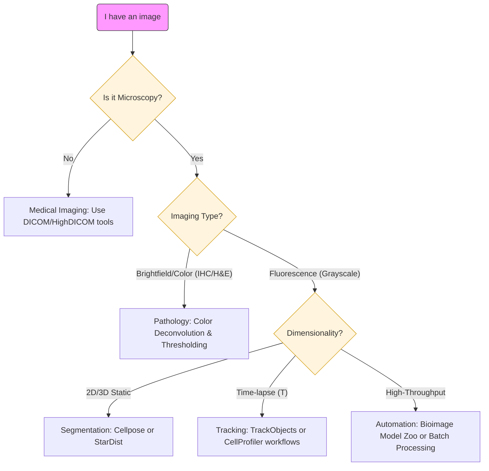

Bioimage analysis is the process of extracting meaningful information (e.g., quantitative data) from image data in the life sciences (usually microscopy images). Whether you are looking at stained tissue sections (histology) or fluorescently labeled proteins in live cells, the goal is often the same: **turning pixels into numbers.**

In Galaxy, we provide a robust ecosystem to make this process reproducible and scalable. We focus on making image analysis **FAIR by design** _(Findable, Accesible, Interoperable, Reusable)_, ensuring that your image formats, metadata, tools, and workflows remain reusable, transparent, and traceable from the very first upload to the final figure ().

This tutorial acts as your **compass** to navigate the Galaxy imaging landscape, specifically as it applies to bioimage data pre-processing and analysis. You will establish the foundations necessary to transform raw, complex image data into structured tables of measurements, ready for downstream statistical analysis.

*To be add: image showing simple workflow, Raw image-Pixels, Numerical Grid for intensities, Data extraction, Final Data*

> <agenda-title></agenda-title>
>
> 1. TOC
> {:toc}
>
{: .agenda}

# 1. Know your data (the "digital anatomy" of an image)

As Pete Bankhead points out in *[Introduction to Bioimage Analysis](https://bioimagebook.github.io/index.html)* (), an image is not just a picture, it is a collection of measurements. Therefore, before starting any analysis, you must understand the underlying structure of your data.

To the human eye, an image is a visual representation of a biological sample. However, to a computer, it is a **numerical array** (). The dimensionality of this array depends on your data:

* A 2D grayscale image is a **matrix** (2D array): rows × columns
* A 2D color image is a **3D array**: rows × columns × channels (RGB)
* A 3D volume is a **3D array**: X × Y × Z
* A multi-dimensional hyperstack is a **tensor**: a multi-dimensional array (e.g., X × Y × Z × C × T)

Every point in that array—the **pixel** (2D) or **voxel** (3D)—is a data point representing the number of photons or the signal intensity detected at that specific coordinate. Understanding your "digital anatomy" means knowing exactly how those numbers were recorded, how they are organized across dimensions, how they are spaced and oriented in 3D space, and what the limitations of the employed imaging technique are (e.g., due to over/undersaturation that leads to clipped intensities).

*Add Pete B's Image from his book*

If you don't understand the numbers behind the colors, you risk performing "Image processing" (simply making a pretty picture) rather than "Image analysis" (extracting scientific truth). Let's unpack the data behind an image step by step. 

## Pixels and voxels

An image is a grid of **pixels** (2D images) or **voxels** (3D images). Think of an image as a vast mosaic where every tile is a "picture element." In 2D, these tiles are flat, but in 3D imaging, they have depth and are called **voxels** ("volumetric elements", e.g., ). Each one is like a small bucket that has captured a specific amount of signal (usually light), which the computer records as a single number.
Image intensities represent the measurements of the imaging system.

To make these numbers useful for science, we must define their **range** and their **spatial extent** (i.e. the *resolution* of the image, like pixels or voxels per real-world unit).

### Bit depth (the range and precision limits)

The bit depth corresponds to an **upper limit of the precision** when storing image intensities by determining the range of possible intensity values and the smallest distinguishable difference between them. The **actual precision** may also be lower and depends on many factors in your imaging system, like sensor noise, photon statistics, optical aberrations, and sample preparation quality (e.g., ).

When it comes to the representation of the measurements of the imaging system as the image intensities, there generally are two main types of such representation:

#### Integer representations

These are the natural format for raw camera data, as imaging sensors essentially count photons:

* **8-bit:** $2^{8} = 256$ discrete levels ($0–255$). While this looks fine to our eyes, it is often too "coarse" for thorough quantitative analysis.
* **16-bit:** $2^{16} = 65,536$ discrete levels ($0–65,535$). This is the **scientific gold standard for acquisition** because it allows you to detect subtle differences in image intensities that would be lost (e.g., due to rounding) when using an 8-bit representation (e.g., ).

#### Floating-point representations

After image processing operations (e.g., background subtraction, normalization, deconvolution), intensity values often become non-integer or fall outside the original acquisition range. Floating-point formats accommodate this:

* **16-bit float (half precision):** Can represent a range of approximately $6.1 \times 10^{-5}$ to $65,504$ with decimal precision. This format is increasingly used in machine learning and GPU-accelerated image processing because it saves memory while providing sufficient precision for many applications.
* **32-bit float (single precision):** Can represent an enormous range (~$10^{-38}$ to ~$10^{38}$) with ~7 significant decimal digits of precision. This is the **most common format for image processing** as it balances precision, range, and computational efficiency.
* **64-bit float (double precision):** Offers even greater precision (~15-16 significant decimal digits) and range (~$10^{-308}$ to ~$10^{308}$), useful for iterative algorithms or when accumulating many operations where small errors could compound.

Note that floating-point images have **different limits** than integer images—instead of a fixed maximum like 255 or 65,535, the "range" depends on your actual data and processing steps. Many analysis tools automatically convert to floating-point internally to preserve accuracy during calculations.

### Spatial calibration (the size)

Image pixels (or voxels) have no _intrinsic_ physical size; they are just units of storage and representation. **Spatial calibration** is the metadata that links these digital units to physical reality (e.g., $1 \text{ pixel} = 0.25 \mu m$). Without this "secret sauce," you can count objects, but you cannot accurately measure how big they are, how fast they move, or their concentration (e.g., , ). 

This calibration information is usually stored in the image header. If you lose this metadata during a file conversion (e.g., saving as a standard .jpg), your analysis will only be able to provide results in "pixels," which have no biological meaning in a publication.

> <tip-title> Avoid saturation </tip-title> 
> If you see an image intensity value of "0", the sensor may have detected nothing, or it could represent true absence of signal—context matters. If you see the maximum value (e.g., $255$ or $65,535$), your sensor was overwhelmed. These phenomena are called **saturation** (under- and oversaturation, respectively). Saturated pixels are often "clipped," meaning the true biological signal was lower or higher than what the camera could record (e.g., ). This data is lost forever and cannot be accurately quantified. 
>
{: .tip}

## The 5 dimensions (5D)

In everyday photography, we usually deal with 2D color images. However, in the life sciences, we can capture **hyperstacks**: multi-dimensional data structures that represent a biological sample across space, spectrum, and time. Most scientific images follow the $(X, Y, Z, C, T)$ convention ():

* **X & Y (Spatial):** The width and height of your image (the 2D plane).
* **Z (Depth):** Multiple optical sections or "slices" taken at different focal planes to reconstruct a 3D volume. In confocal or light-sheet microscopy, these represent different depths through the sample.
* **C (Channel):** Different wavelengths or fluorescent probes corresponding to specific biological structures or molecules (e.g., DAPI for nuclei, GFP for proteins, Phalloidin for actin).
* **T (Time):** Separate frames captured over a duration (time-lapse), allowing you to track movement, growth, or dynamic changes in cellular processes.

However, it is important to note that while we describe them in this $(X, Y, Z, C, T)$ order, different microscope vendors and file formats store them in different orders (e.g., $TZCXY$, $XYCZT$). Ensuring that the dimensional order is properly annotated within the image metadata is essential so that Galaxy (and any image analysis software in general) doesn't accidentally interpret a Z-slice as a time-point or a channel as a Z-position (e.g., ).

> <tip-title> Respect the channels </tip-title> 
> While we often look at "merged" RGB images for presentations, you should **always perform quantification on the raw, individual channels.** Merging or converting to RGB often involves data compression, bit-depth reduction (typically down to 8-bit), or intensity scaling that distorts the underlying measurements and loses quantitative information (). Each channel should be analyzed separately and then results can be compared or combined downstream.
> 
{: .tip}

> <question-title> Identify the dimensions </question-title>
>
> If you have a time-lapse experiment where you recorded 3 different fluorescent markers across 10 focal planes (Z-slices) every minute for an hour, how many total 2D images (planes) are in your file?
>
> > <solution-title></solution-title>
> >
> > You would have $3 \text{ (Channels)} \times 10 \text{ (Z-slices)} \times 60 \text{ (Time points)} = 1,800$ total 2D planes. Each individual plane is an $X \times Y$ image. Galaxy tools need to know the correct dimensional order (e.g., $XYZCT$ vs. $XYCZT$ vs. $TZCXY$) to ensure they correctly interpret which dimension is which—otherwise, you might accidentally measure intensity changes across Z-depth when you meant to measure changes over time!
> >
> {: .solution} 
{: .question}

## Bit depth: why it matters for science

A common misconception is that if two images look identical on a desktop monitor, they contain the same data. However, our eyes are used to computer screens that are usually limited to 8-bit, while your microscope sensor is far more sensitive. 

When you perform certain pre-processing tasks, such as subtracting the image background or contrast enhancement, you are essentially **stretching the histogram** of the image data.

* In **8-bit**, with only 256 possible values, stretching creates more pronounced "gaps" in your histogram (quantization artifacts), potentially making your data distribution appear discontinuous.
* In **16-bit integer**, with 65,536 possible values, the same stretching operation creates smaller relative gaps. While quantization artifacts still occur, they are far less severe and less likely to impact downstream quantitative analysis ().

The key difference is not whether artifacts appear, but their **magnitude relative to your data range**. Think of it this way: spreading 256 values across a wider range creates larger "jumps" between adjacent intensity levels than spreading 65,536 values across the same range.

*Add here example images of how two images that look the same to the human eye have different data*

> <tip-title> Precision </tip-title> 
> Always try to keep your data in **16-bit integer** or **floating-point formats** (16-bit, 32-bit, or 64-bit float) during analysis. Converting to 8-bit too early reduces your ability to detect subtle intensity differences and makes quantization artifacts more severe during processing. This lost precision can never be recovered (). 
>
{: .tip}

> <question-title> Why use floating-point instead of 16-bit integer? </question-title>
>
> We already covered different floating-point formats in the bit depth section above. But why would we need to convert from 16-bit integer to floating-point during analysis?
>
> > <solution-title></solution-title>
> >
> > 16-bit **integer** images can only store whole numbers (0–65,535). Many image processing operations produce non-integer results that would be lost through rounding:
> >
> > * Dividing pixel intensity 5 by 2 gives 2.5 (must be rounded to 2 or 3 in integer format)
> > * Background subtraction can produce negative values (impossible in unsigned integer format)
> > * Averaging two pixels with values 100 and 101 gives 100.5 (precision lost in integer)
> > * Normalizing intensities often produces fractional values
> >
> > Floating-point formats preserve these exact values, preventing cumulative rounding errors across multiple processing steps. Additionally, floating-point formats can represent values outside the 0–65,535 range, which is useful when processing operations produce negative values or very large values (e.g., summing multiple images) (e.g., ). Most image analysis software automatically converts to 32-bit float internally for this reason.
> >
> {: .solution}
{: .question}

# 2. How to get your images into Galaxy

Galaxy is built to handle the complexity of biological data. However, microscopy images often come in "vendor-specific" formats. Your entry point into Galaxy depends on how your data was saved:

* **Standard Formats (.tiff, .png):** Use the standard Galaxy **Upload** tool.
* **Proprietary Formats (.czi, .nd2, .lif):** These formats "wrap" image data and metadata together. While you can often export TIFFs from your microscope software, using the **** tool allows Galaxy to "unlock" and standardize the metadata hidden inside these files ().
* **OMERO Integration:** If your institution uses an **OMERO server**, you can import images directly via the **Remote Files** section in the upload tool.

## Why use the Bio-Formats tool suite?

The **** tool does more than just open a file; it acts as a **translator**. It extracts the "digital anatomy" (metadata)—such as pixel size, laser wavelengths, and objective settings—and converts the proprietary data into standardized open formats. This ensures that your analysis remains reproducible and that your metadata remains **FAIR** throughout the entire Galaxy workflow ().

> <hands-on-title> Inspecting Image Metadata </hands-on-title>
>
> 1.  with the following parameters:
>    -  *"Input image"*: `Select your uploaded microscopy file`
> 2. **Review the output:** Examine the resulting text file. Look for key metadata fields like "PhysicalSizeX" (pixel calibration) and "BitDepth". 
>
> *Add image and output example*
> > <comment-title>Why check this first?</comment-title>
> > Before starting a long analysis, this tool helps you verify if Galaxy correctly "unlocked" the metadata inside your proprietary file. If pixel sizes are missing here, your final results will be in pixels rather than biological units like micrometers ($\mu m$).
> {: .comment}
>
{: .hands_on}

For modern, large-scale, or cloud-based datasets, you can use ****. This converts a wide range of formats into **OME-Zarr** following the OME-NGFF specification. OME-Zarr is specifically optimized for high-performance viewing and is a staple for massive datasets like those found in spatial transcriptomics.

> <tip-title> Which open format should I choose? </tip-title>
>
> While there are many options, two open standards dominate bioimaging:
> * **OME-TIFF:** Best for "classic" microscopy (2D/3D stacks) and maximum compatibility with classical software like ImageJ/Fiji or QuPath.
> * **OME-Zarr:** The modern choice for "Big Data," cloud storage, and spatial transcriptomics. 
> 
> Both are superior to proprietary formats because they ensure your metadata stays attached to your pixels throughout the entire Galaxy workflow.
>
{: .tip}

> <question-title> Metadata testing </question-title>
>
> Why we should avoid bioimages to be "Save as JPEG" from your microscope or computer?
>
> > <solution-title></solution-title>
> >
> > 1. **Data Integrity:** JPEGs use "lossy" compression, which changes pixel values to save space. This approach literally modifies your scientific data.
> > 2. **Metadata Retention:** A standard JPEG or simple TIFF often "strips" the metadata. You would lose the information about how many microns are in a pixel, making it impossible to calculate the real size of your objects later.
> >
> {: .solution}
{: .question}

# 3. Before you begin: diagnose your data

The first step in any analysis is understanding what you are holding. Before clicking any tools, ask yourself these four questions:

 - **What was the imaging modality?** (Fluorescence microscopy, brightfield histology, high-content screening?)
 - **What is the biological subject?** (Individual cells, complex tissues, or subcellular structures?)
 - **What is the file format?** (Standard formats like .tif and .png, or proprietary vendor formats like .czi, .nd2, or .lif?)
 - **Where is the data stored?** (A local drive, an OMERO server, a public repository, or a remote URL?)

Depending on your answers, your starting path in Galaxy will change.

# 4. The lifecycle of an analysis pipeline

A typical project in Galaxy is not a single click, but a sequence of logical stages. Think of it as a factory assembly line: you start with raw materials (pixels) and move through various stations until you have a finished product (a table of results). Let's examine these stages together.

## Stage A: Pre-processing (cleaning)
Raw images are rarely perfect. They often contain electronic noise from the camera, uneven lighting from the microscope, or staining artifacts. Pre-processing prepares your "digital anatomy" for the computer to read it more easily by improving the signal-to-noise ratio ().

* **Background subtraction:** Removes the "haze" or background fluorescence caused by out-of-focus light. This is crucial for accurate intensity measurements later on.
* **Denoising:** Uses mathematical filters to smooth the image. A **Gaussian filter** smooths everything slightly to reduce graininess, while a **Median filter** is excellent for removing "salt and pepper" noise while keeping the edges of your cells sharp ().

> <tip-title> Document your filters </tip-title> 
> Every filter you apply changes the pixel values. While this is necessary for segmentation, you must document these steps to ensure reproducibility. In Galaxy, this is done automatically by your history, which records every parameter used in your pre-processing steps.
{: .tip} 

In Galaxy, you can start the pre-processing stage with tools like ****.

> <hands-on-title> Filtering Noise </hands-on-title>
>
> 1.  with the following parameters:
>    -  *"Type of image data to process"*: `2-D image data (or series thereof)`
>        -  *"Input image (2-D)"*: `your_uploaded_image.tif`
>        -  *"Filter type"*: `Median`
>            -  *"Size"*: `3`
>
> > <comment-title>Choosing the right filter</comment-title>
> > Try running this tool twice: once with a **Median** filter (using a small *Size* like 3) and once with a **Gaussian** filter (adjusting *Sigma*). Zoom in on the edges of your objects. You will notice that the Median filter preserves boundaries much better, while the Gaussian filter blurs them.
> {: .comment}
>
{: .hands_on}

## Stage B: Segmentation (Defining objects)
This is the most critical step. Here, you tell the computer which pixels belong to an "object" (like a nucleus) and which belong to the "background." 

* **Thresholding:** A simple "cutoff" method. You decide that any pixel brighter than a certain value is part of your object. This usually results in a **Binary Mask**.
* **Inference (Deep Learning):** Advanced AI models like **Cellpose** or **StarDist** use pre-trained neural networks to recognize complex shapes. These are superior at "untangling" cells that are touching or overlapping in high-density environments (, ).

[Image comparing simple thresholding versus AI-based instance segmentation in crowded tissues]

> <hands-on-title> Creating a Segmentation Mask </hands-on-title>
>
> 1.  with the following parameters:
>    -  *"Input image"*: `your_filtered_image.tif`
>    -  *"Thresholding method"*: `Globally adaptive / Otsu`
>        -  *"Offset"*: `0`
>    -  *"Invert output labels"*: `No`
>
> 2. **Review the output:** You should now have a binary image where your biological objects are represented as white pixels (255) on a black background (0).
>
{: .hands_on}

> <comment-title>Masks vs. Label Images</comment-title>
> It is important to distinguish between these two types of images in Galaxy:
>
> * **Binary Mask:** This is what you created with the **Threshold** tool. Every pixel is either "Background" (0) or "Foreground" (255). It tells the computer *where* the objects are, but it doesn't know that one cell is different from the one next to it.
> * **Label Image:** Tools like **Label objects** (Connected Component Analysis) take a mask and assign a unique integer to every separate "blob." The first cell’s pixels all become `1`, the second cell `2`, and so on.
>
{: .comment}

## Stage B.2: The Region of Interest (ROI)

Once you have segmented your image, you have created **Regions of Interest (ROIs)**. This is a central concept in bioimaging. An ROI is a spatial selection that tells the software: "Ignore the background; only calculate values for these specific coordinates."

In Galaxy, ROIs can take three forms depending on the tool you use:
* **Bounding Boxes:** Simple rectangles used to crop an image or define a search area. In Galaxy, this is only possible to perform this step using interactive tools like Qupath.
* **Binary Masks:** A "stencil" where the ROI is white and everything else is black.
* **Label Images:** A "smart map" where every individual ROI has its own unique integer ID ().

> <comment-title>ROIs in interactive vs. automated tools</comment-title>
> In interactive tools like **QuPath**, you often draw ROIs by hand with a mouse. In automated Galaxy workflows, we use algorithms like **Cellpose** to "draw" thousands of ROIs instantly and reproducibly ().
{: .comment}

## Stage C: Post-processing (Refining)
Computers are literal; they might detect tiny specs of dust as "cells." Post-processing is your "cleanup crew" for the mask you created in Stage B.
* **Size filtering:** Automatically removing any detected objects that are too small (noise) or too large (clumps of cells) to be biologically relevant.
* **Morphological operations:** Using operations like "Fill Holes" to fix gaps inside a detected cell or "Erode/Dilate" to slightly adjust the boundaries.

## Stage D: Quantification (Extracting numbers)
Now that you have a clean mask, Galaxy "overlays" it back onto your original raw image. Since the computer knows exactly which pixels belong to which cell, it can now do the math:
* **Intensity:** "How much protein (fluorescence) is inside this specific mask?"
* **Morphology:** "How large, round, or elongated is this nucleus?"
* **Spatial distribution:** "How far is the nucleus from the cell membrane?"

## Stage E: Validation (The sanity check)

**Never trust an algorithm blindly.** The final step is a visual inspection to ensure your numerical outputs represent biological reality rather than processing artifacts (). 

* ****: This tool takes your **original image** and draws the boundaries of your **detected objects** (from your Label Image) on top of it as colored lines. It is the gold standard for visual validation, allowing you to confirm that the computer's segmentation accurately followed the biological edges of your cells.

* ****: A versatile tool for visualizing colocalization or blending two different channels to see where biological signals overlap.

> <tip-title> Garbage In, Garbage Out </tip-title>
> If your segmentation (Stage B) is poor, your quantification (Stage D) will be meaningless. Always spend the most time optimizing your segmentation and validating it visually before trusting the final spreadsheet of numbers ().
{: .tip}

> <question-title> Mask vs. Image </question-title>
>
> If you calculate the **Mean Intensity** of a cell, should you use the pixels from the **Binary Mask** or the **Raw Image**?
>
> > <solution-title></solution-title>
> >
> > You must use the **Raw Image**. The mask is just a "stencil" or a map that tells the computer *where* to look. The actual biological information (the intensity values) is only found in the original, unprocessed image.
> >
> {: .solution}
{: .question}

# 4. Finding your workflow: modality and tools

Bioimage analysis is not "one size fits all." Galaxy provides a diverse suite of tools,from classical computer vision to state-of-the-art Deep Learning. Use the logical roadmap below to identify your specific path.

## The decision tree: your logical roadmap

## The Galaxy imaging toolbox 

Once you have identified your path on the tree, use this guide to find the corresponding tools in Galaxy. We categorize these into **Standard Tools** (for automated batch processing) and **Interactive Tools** (for visual exploration).

### A. Standard tools (single images, high-performance & batch)

These tools are "wrapped" in Galaxy to build individual workflows and adapt your analysis to your biological question needs. 

These other set of "wrapped" tools allow you to run them on hundreds of images as part of a reproducible history.

| Tool Name | Primary Application | Key Benefit |
| --- | --- | --- |
| **** | General cellular segmentation | Superior at "unsticking" crowded or overlapping cells using vector flow. |
| **** | High-content screening & automation | Allows you to build a complex multi-step "pipeline" and run it on thousands of images consistently. |
| **** | Advanced AI model inference | Gateway to the [BioImage Model Zoo](https://bioimage.io/), run pre-trained models (like 3D U-Nets) on your data. |

> <hands-on-title> Segmentation with Cellpose </hands-on-title>
>
> In Galaxy, you can choose between the standard Cellpose model or the newer Cellpose-SAM (Segment Anything Model) version. 
>
> Option 1: Standard Cellpose
> 1.  with the following parameters:
>    -  *"Choose the image file for segmentation"*: `your_preprocessed_image.tif`
>    -  *"Choose the pre-trained model type"*: `cyto2` (standard cells) or `nuclei` (just nuclei)
>    -  *"Whether to show segmentation?"*: `Yes` (generates a PNG preview)
>    - In **Advanced Options**:
>        -  *"Cell or nuclei diameter in pixels"*: `Enter approximate diameter` (or leave blank for automated estimation)
>
> Option 2: Cellpose-SAM (Next Gen)
> 1.  with the following parameters:
>    -  *"Choose the image file for segmentation"*: `your_preprocessed_image.tif`
>    -  *"Save masks as tiff?"*: `Yes` (Required for quantification later)
>    -  *"Save RGB outline images"*: `Yes` (Useful for Stage E: Validation)
>    - In **Advanced Options**:
>        -  *"Cell or nuclei diameter in pixels"*: `Enter approximate diameter`
>        -  *"Whether to use transformer backbone"*: `Yes` (to utilize the Cellpose3 transformer model)
>
> > <comment-title>Multi-channel Images</comment-title>
> > Cellpose tools in Galaxy typically expect single-channel 2D images. If you have a multi-channel image, you must first use the **Split image along axes** tool to extract the specific channel (e.g., the DAPI channel for nuclei) that you wish to segment.
> {: .comment}
{: .hands_on}

### B. Interactive tools (Visual exploration)

If you prefer a "hands-on" approach to see your results in real-time before scaling up, launch an **Interactive Tool (IT)** directly in your browser:

* **:** The gold standard for digital pathology. Use this for large tissue sections and to access **StarDist** segmentation.
* **:** Best for "training by example"—manually paint a few cells to teach the computer how to segment the rest based on texture.
* **:** & **:** Useful for building and fine-tuning your parameters visually before running a massive batch job.

## Identifying your modality 

To navigate the tree correctly, you must understand your image type:

* **Fluorescence:** Images where pixel intensity represents the amount of light emitted. While often visualized as multi-colored immunofluorescence, the computer treats each channel as an intensity map where higher values indicate more signal.

* **Brightfield/Histology (Color):** True-color images (RGB) where stains like H&E overlap. You must use **Color Deconvolution** to separate these into individual channels (e.g., separating Hematoxylin from DAB) before measurement. In Galaxy, you may find this tool as: 

* **High-density/Tissues:** For packed cells, classical thresholding fails. This is where **Inference** tools like **Cellpose** or **StarDist** shine, as they use pre-trained models to predict boundaries even in crowded environments.
[Image comparing simple thresholding versus AI-based instance segmentation in crowded tissues]

## Practice: applying the roadmap

> <question-title> Scenario 1: The High-Volume Screen </question-title>
> You have 500 images of crowded mitochondria. Which path do you choose?
> > <solution-title></solution-title>
> 
> > You should look toward a **Deep Learning** approach (like **Cellpose**) within a **CellProfiler** workflow. Why?
> 
> > 1. **Crowding:** Cellpose handles overlapping structures better than simple thresholding.
> > 2. **Volume:** With 500 images, you need the batch-processing power of **CellProfiler** to stay efficient.
> > 
> {: .solution}
{: .question}

> <question-title> Scenario 2: The 3D Volume </question-title>
> You have a single 3D Z-stack of a zebrafish embryo with one fluorescent marker. What is your path?
> > <solution-title></solution-title>
> 
> > 1. **Microscopy?** Yes.
> > 2. **Color or B&W?** B&W (Single-channel fluorescence).
> > 3. **Dimensionality?** 3D volume.
> > **Result:** You are on the **Segmentation** path. Use **Cellpose** for automated results or **QuPath** interactively to test different StarDist models.
> > 
> {: .solution}
{: .question}
 

# 6. Common pitfalls to avoid

Even with the best tools, it is easy to accidentally "break" your data before you even start measuring. In bioimage analysis, these errors are often called **artifacts**.

## 1. The "JPG" trap
**Never use JPEG for science.** JPEGs use "lossy" compression, meaning the computer slightly changes pixel intensities to save space. This creates "blocky" artifacts that ruin your ability to measure protein concentration or fine textures.
* **The fix:** Always use **TIFF**, **OME-TIFF**, or **PNG**. These are "lossless" formats that preserve every photon counted by the camera.

## 2. The "merged image" mistake
Analyzing a "Merge" (RGB) image is risky because the intensities of different channels (like DAPI and GFP) are mathematically blended into a single color value.
* **The fix:** Always **Split Channels** in Galaxy. For this purpose you may the **{% tool [Split image along axes
with NumPy](toolshed.g2.bx.psu.edu/repos/imgteam/split_image/ip_split_image/2.3.5+galaxy0). Measure your DAPI (nuclei) and GFP (protein) separately to ensure scientific accuracy.} 

## 3. Ignoring Saturation
If your image is too bright, you might hit the camera sensor's limit ($255$ for 8-bit or $65,535$ for 16-bit). This is called **Clipping**. 
* **The fix:** Check your histogram. If you see a giant "spike" at the very end of the graph, your data is saturated and you cannot accurately quantify the brightest parts of your sample.

> <question-title> The Artifact Detective </question-title>
>
> You notice that in your time-lapse, the image gets slightly dimmer with every frame. Is this a biological change or an artifact?
>
> > <solution-title> Solution </solution-title>
> >
> > This is likely **Photobleaching**, a common artifact where fluorescent molecules physically break down and lose their ability to emit light after repeated exposure to the excitation laser.
> >
> > 
> >
> > The standard approach to fix this is **Bleach Correction**. While a dedicated tool for this is not currently in this Galaxy workflow, you can use  with the **CLAHE** algorithm as a workaround. 
> >
> > This does not "fix" the physical loss of signal, but it enhances the local contrast of the dim frames. This makes it possible for the segmentation tools to still detect and outline your objects in the later, darker stages of the experiment.
> >
> {: .solution}
{: .question}

# Conclusion

Congratulations! You have navigated the core principles of the Galaxy bioimaging landscape. By mastering these tools, you have moved beyond simply "looking" at images to performing rigorous, reproducible quantification.

In this tutorial, you have learned that:

* **Images are data:** Every pixel is a mathematical value. Whether you are adjusting bit depth or calibrating scales, you are ensuring that these numbers represent physical reality.
* **Context matters:** Using **Bio-Formats** and managing metadata ensures that your analysis respects the original biological dimensions, time-points, and channels.
* **Segmentation is a bridge:** Creating masks and label images is the critical step that allows a computer to recognize individual biological entities, such as cells or nuclei, for separate measurement.
* **Validation is essential:** Tools like **Overlay Outlines** and artifacts like **Photobleaching** remind us that automated analysis requires human oversight to ensure the results are biologically sound.

By building modular workflows in Galaxy, you have created a pipeline that is not only accurate but also shareable and reproducible, the **_gold standard_** of modern open science.

# 7. Glossary of Bioimage Terms

* **Binary Image:** A black-and-white image where pixels can only have two values: 0 (Background) and 1 (Object).
* **Color Deconvolution:** The mathematical separation of overlapping color stains (like the purple Hematoxylin and pink Eosin in H&E histology) into individual intensity channels for measurement.

* **Mask:** A binary "stencil" or digital cutout that tells the computer exactly which pixels belong to an object of interest and which should be ignored.
* **OME-TIFF:** An open-source, standardized file format designed for microscopy that packages raw pixel data together with its essential metadata.
* **Saturation:** A digital clipping artifact that occurs when light intensity exceeds the camera sensor's maximum capacity, resulting in lost data and "flat" peaks where the brightest signals should be.

# 8. Next Steps: Choose your Tutorial

Now that you have your "compass," it is time to choose a specific path. Pick the tutorial that matches your research goal:

* **The Basics:** [Introduction to Image Analysis]() – A deeper dive into the fundamental concepts of digital images.

* **Fluorescence & Screening:** [HeLa Cell Screen Analysis]() – Learn to process high-throughput screens using classical techniques.

* **Time-Lapse & Events:** [Detection of MitoFlashes]() – Track transient biological events over time.

* **Classical Segmentation:** [Voronoi-based Segmentation]() – A powerful approach for partitioning cells when they are touching but have clear centers.

* **Advanced AI:** [Imaging using Bioimage Zoo Models]() – Use pre-trained deep learning models for complex segmentation tasks.

* **Automated Pipelines:** [CellProfiler in Galaxy]() – Master the use of CellProfiler modules to build end-to-end automated workflows.

* **Tracking:** [Object Tracking using CellProfiler]() – Move from static images to following individual objects through time and space.

* **Histology & Pathology:** *Coming Soon!* A dedicated tutorial on **Histology Staining and Color Deconvolution** is currently in development.
