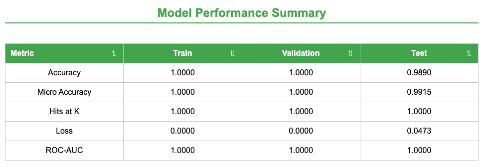
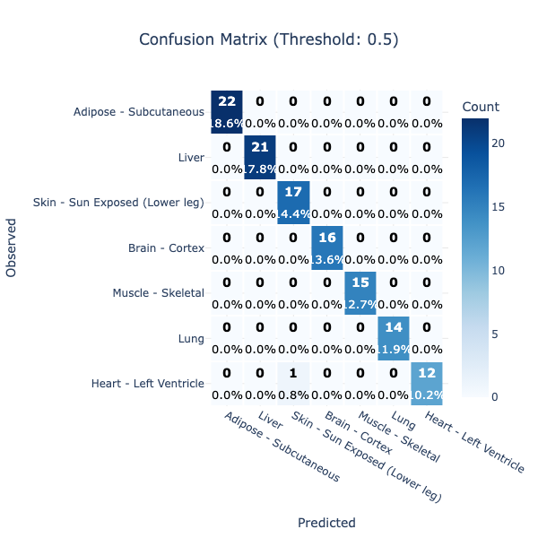

Convolutional neural networks can learn hierarchical features directly from image pixels, making them powerful tools for image classification. This capability has motivated researchers to encode genomic and other non-image data as image-like representations that can be analyzed with image-based deep learning models  . In particular, RNA-seq gene expression profiles have been transformed into two-dimensional images and classified by fine-tuning pretrained convolutional neural networks . Galaxy's Image Learner makes this general strategy accessible through a web interface in which users provide images, labels, and training settings.

In this tutorial, we apply that strategy to GTEx gene expression data, which are normally represented as tables containing thousands of gene-level TPM values for each sample. We log-transform each sample's expression vector, place the values into a fixed-order square array, save the array as a grayscale image, and train Image Learner to predict the tissue of origin. This simple transformation is intended as a teaching example: unlike methods that arrange related features near one another , the spatial relationships in these images are determined by gene order and should not be interpreted as biological proximity.

The main tutorial uses prepared files from Zenodo so that you can focus on configuring Image Learner, training the tissue classifier, and interpreting its outputs. An optional section explains how to generate the images and labels from the raw GTEx v11 files, allowing you to rebuild the dataset, select different tissues, change the number of samples per tissue, or explore alternative preprocessing choices.

> <agenda-title></agenda-title>
>
> In this tutorial, we will cover:
>
> 1. TOC
> {:toc}
>
{: .agenda}

# GTEx Dataset

> <comment-title>Background</comment-title>
>
> GTEx is a large reference resource for studying human gene expression across tissues . The modeling idea used here treats each sample's vector of gene TPM values as a structured image: values are log-transformed, padded to a square, and saved as a grayscale image. A tissue classifier can then learn tissue-specific expression patterns using Galaxy Image Learner.
>
{: .comment}

The raw data used to create this tutorial dataset were downloaded from the [GTEx Portal](https://gtexportal.org/). The GTEx Portal provides multiple GTEx releases and many file types, including expression matrices, metadata, eQTL files, histology resources, and other analysis outputs. For this image-classification workflow, we need two specific pieces of information:

- A gene-level expression matrix, so each sample can be represented by a vector of expression values.
- Sample metadata, so each sample can be assigned a tissue label for supervised learning.

The GTEx v11 gene TPM file and v11 sample attributes file provide exactly those inputs. TPM values are normalized expression measurements that are appropriate for comparing gene expression profiles across samples in this tutorial context. The sample attributes file links each sample ID to tissue metadata, including the detailed tissue label (`SMTSD`) used as the class label.

| File | Direct URL | Use |
|---|---|---|
| `GTEx_Analysis_2025-08-22_v11_RNASeQCv2.4.3_gene_tpm.gct.gz` | [GTEx v11 gene TPM GCT](https://storage.googleapis.com/adult-gtex/bulk-gex/v11/rna-seq/GTEx_Analysis_2025-08-22_v11_RNASeQCv2.4.3_gene_tpm.gct.gz) | Gene TPM matrix |
| `GTEx_Analysis_v11_Annotations_SampleAttributesDS.txt` | [GTEx v11 sample attributes](https://storage.googleapis.com/adult-gtex/annotations/v11/metadata-files/GTEx_Analysis_v11_Annotations_SampleAttributesDS.txt) | Sample labels and QC metadata |

The raw GCT expression matrix has genes as rows and samples as columns. The sample attributes file includes:

| Column | Meaning |
|---|---|
| `SAMPID` | GTEx sample identifier. This must match expression matrix sample columns. |
| `SMTS` | Broad tissue category. |
| `SMTSD` | Detailed tissue label used as the classification target in this tutorial. |

The raw expression matrix is large: it contains many genes and many GTEx samples, so loading the full table into memory can be expensive. Each sample column contains the expression profile for one biospecimen. Each row corresponds to a gene, and the values summarize RNA-seq abundance as TPM. The annotation table contains technical and biological metadata for the samples, including identifiers, tissue categories, and quality-related fields.

This structure makes GTEx useful for many machine learning tasks. In this tutorial, the task is tissue classification: given the expression pattern of a sample, can a model identify the tissue it came from? Because different tissues express different sets of genes at different levels, GTEx provides a strong biological signal for this type of classification problem.

## GTEx dataset transformation

We will train the model with Image Learner, a Galaxy tool available on Galaxy servers such as [usegalaxy.org](https://usegalaxy.org/) when the tool is installed. Image Learner expects image-based training data in a specific format:

- A metadata table with one row per image.
- An `image_path` column that names the image file inside the ZIP archive.
- A `label` column that contains the class to predict.
- A ZIP archive containing all image files referenced by the metadata table.

To convert tabular gene expression data into images, we treat each sample's gene expression values as a long list of numbers. First, the values are log-transformed to reduce the effect of very large expression values. Then the vector is padded with zeros until it can fill a square. Finally, the square array is saved as a grayscale image, where darker and lighter pixels represent lower and higher transformed expression values. The image is not a photograph or a biological tissue picture; it is a structured representation of the sample's expression profile that an image model can process.

> <tip-title>How expression values become image inputs</tip-title>
>
> We have already made the generated Image Learner inputs available on Zenodo, and those prepared files are the recommended starting point for this tutorial. However, you can also generate the files inside Galaxy with the JupyterLab Interactive Tool, or run the same script locally if your computer has Python, the required Python packages, enough memory to process the GTEx expression matrix, and enough disk space for the downloaded GTEx files and generated images. By changing parameters such as `SELECTED_TISSUES` and `SAMPLES_PER_TISSUE`, you can create different tissue-classification tasks and test how the model behaves.
>
>> <hands-on-title>Optional: Generate GTEx expression images in Galaxy JupyterLab</hands-on-title>
>>
>> 1. Create or switch to the Galaxy history where you want the rebuilt files to appear.
>>
>> 2. In the Galaxy tool panel, open **Interactive Tools** and select **JupyterLab Notebook**.
>>
>> 3. Use the default JupyterLab environment. Click **Run Tool** to start the JupyterLab Interactive Tool.
>>
>>    The JupyterLab job will appear in your Galaxy history. Wait until it is running, then open it from the history dataset or from **User** > **Active Interactive Tools**.
>>
>> 4. In JupyterLab, open a terminal with **Others** > **Terminal**.
>>
>> 5. Check that the Python packages needed by the script are available:
>>
>>    ```bash
>>    python -c "import numpy, pandas, matplotlib, psutil; print('Python environment is ready')"
>>    ```
>>
>>    If this command reports a missing package, install the missing dependencies in the JupyterLab environment:
>>
>>    ```bash
>>    python -m pip install --user numpy pandas matplotlib psutil
>>    ```
>>
>> 6. Download the GTEx v11 expression matrix and sample annotation file directly from the GTEx links:
>>
>>    ```bash
>>    curl -L -o GTEx_Analysis_2025-08-22_v11_RNASeQCv2.4.3_gene_tpm.gct.gz https://storage.googleapis.com/adult-gtex/bulk-gex/v11/rna-seq/GTEx_Analysis_2025-08-22_v11_RNASeQCv2.4.3_gene_tpm.gct.gz
>>    curl -L -o GTEx_Analysis_v11_Annotations_SampleAttributesDS.txt https://storage.googleapis.com/adult-gtex/annotations/v11/metadata-files/GTEx_Analysis_v11_Annotations_SampleAttributesDS.txt
>>    ```
>>
>> 7. Create the Python script in JupyterLab:
>>
>>    - Click **File** > **New** > **Python File**.
>>    - Paste the script below into the editor.
>>    - Save the file, then rename it in the JupyterLab file browser to `gtex_v11_to_images_adaptive.py`.
>>    - Keep it in the same folder as the two downloaded GTEx files.
>>
>> 8. Before running the script, edit the variables near the top if you want to change the dataset:
>>
>>    - `SELECTED_TISSUES`: choose which GTEx tissue labels to model. The names must match `SMTSD` values in the GTEx annotation file.
>>    - `SAMPLES_PER_TISSUE`: choose how many samples to use per tissue. Use a small value first if the Galaxy server has limited memory.
>>    - `RANDOM_SEED`: keep this fixed for reproducible sampling, or change it to select a different random subset.
>>    - `NORMALIZATION_METHOD`: use `log` for the recommended default, or test `minmax`, `zscore`, or `none`.
>>    - `LUDWIG_OUTPUT` and `ZIP_OUTPUT`: change these only if you want different output filenames.
>>
>>    > <tip-title>Choosing tissues and sample counts</tip-title>
>>    >
>>    > `SELECTED_TISSUES` and `SAMPLES_PER_TISSUE` are intentionally explicit. Start with a small balanced task so the tutorial runs quickly, then expand the tissue list or increase the sample count once the workflow is working on your Galaxy server.
>>    >
>>    {: .tip}
>>
>>    ```python
>>    # gtex_v11_to_images_adaptive.py
>>    #
>>    # Memory-adaptive GTEx V11 image pipeline for Galaxy JupyterLab.
>>    #
>>    # What this script does:
>>    #   1. Checks available CPU and RAM.
>>    #   2. Chooses safer/faster settings based on the computer.
>>    #   3. Loads GTEx annotation metadata.
>>    #   4. Selects samples from selected tissues.
>>    #   5. Reads the large TPM matrix in chunks.
>>    #   6. Creates one grayscale JPG image per sample.
>>    #   7. Creates ludwig_input.csv.
>>    #   8. Zips all images for Galaxy upload.
>>
>>    import math
>>    import os
>>    import zipfile
>>    from pathlib import Path
>>
>>    import matplotlib
>>    import numpy as np
>>    import pandas as pd
>>
>>    matplotlib.use("Agg")
>>    from matplotlib import pyplot as plt
>>
>>
>>    TPM_FILE = "GTEx_Analysis_2025-08-22_v11_RNASeQCv2.4.3_gene_tpm.gct.gz"
>>    ANNOTATION_FILE = "GTEx_Analysis_v11_Annotations_SampleAttributesDS.txt"
>>
>>    SELECTED_TISSUES = [
>>        "Brain - Cortex",
>>        "Heart - Left Ventricle",
>>        "Liver",
>>        "Lung",
>>        "Muscle - Skeletal",
>>        "Adipose - Subcutaneous",
>>        "Skin - Sun Exposed (Lower leg)",
>>    ]
>>    SAMPLES_PER_TISSUE = 200
>>    RANDOM_SEED = 42
>>    NORMALIZATION_METHOD = "log"
>>    IMAGE_DIR = "output_images"
>>    METADATA_OUTPUT = "metadata_base.csv"
>>    LUDWIG_OUTPUT = "ludwig_input.csv"
>>    ZIP_OUTPUT = "output_images.zip"
>>
>>
>>    def get_available_ram_gb():
>>        try:
>>            import psutil
>>
>>            return psutil.virtual_memory().available / (1024 ** 3)
>>        except ImportError:
>>            print("psutil is not installed. Using conservative memory settings.")
>>            return 4.0
>>
>>
>>    def get_cpu_count():
>>        return os.cpu_count() or 1
>>
>>
>>    def choose_runtime_settings():
>>        ram_gb = get_available_ram_gb()
>>        cpu_count = get_cpu_count()
>>
>>        if ram_gb >= 32:
>>            profile = "high-resource"
>>            chunksize = 5000
>>        elif ram_gb >= 16:
>>            profile = "medium-resource"
>>            chunksize = 2500
>>        elif ram_gb >= 8:
>>            profile = "low-resource"
>>            chunksize = 1000
>>        else:
>>            profile = "very-low-resource"
>>            chunksize = 250
>>
>>        print("Computer resource profile:")
>>        print(f"  Available RAM: {ram_gb:.2f} GB")
>>        print(f"  CPU cores: {cpu_count}")
>>        print(f"  Selected profile: {profile}")
>>        print(f"  TPM read chunksize: {chunksize}")
>>
>>        return {"ram_gb": ram_gb, "cpu_count": cpu_count, "profile": profile, "chunksize": chunksize}
>>
>>
>>    def load_and_select_metadata():
>>        print("Loading annotation file...")
>>        annot = pd.read_csv(ANNOTATION_FILE, sep="\t")
>>
>>        required = {"SAMPID", "SMTSD"}
>>        missing = required - set(annot.columns)
>>        if missing:
>>            raise ValueError(f"Missing required annotation columns: {missing}")
>>
>>        annot = annot[annot["SMTSD"].isin(SELECTED_TISSUES)].copy()
>>        annot = annot.drop_duplicates(subset=["SAMPID"])
>>
>>        selected = []
>>        for tissue, group in annot.groupby("SMTSD"):
>>            n = min(SAMPLES_PER_TISSUE, len(group))
>>            selected.append(group.sample(n=n, random_state=RANDOM_SEED))
>>
>>        if not selected:
>>            raise ValueError("No samples found for SELECTED_TISSUES.")
>>
>>        meta = pd.concat(selected).reset_index(drop=True)
>>        labels = meta[["SAMPID", "SMTSD"]].rename(columns={"SAMPID": "sample_id", "SMTSD": "label"})
>>        labels.to_csv(METADATA_OUTPUT, index=False)
>>
>>        print("Selected samples per tissue:")
>>        print(labels["label"].value_counts().sort_index())
>>        return labels
>>
>>
>>    def get_available_selected_samples(selected_sample_ids):
>>        print("Reading GCT header...")
>>        header = pd.read_csv(TPM_FILE, sep="\t", skiprows=2, nrows=0, compression="gzip")
>>
>>        available_samples = [sample_id for sample_id in selected_sample_ids if sample_id in header.columns]
>>        missing = sorted(set(selected_sample_ids) - set(available_samples))
>>        if missing:
>>            print(f"Warning: {len(missing)} selected samples were not found in TPM matrix.")
>>
>>        if not available_samples:
>>            raise ValueError("None of the selected samples were found in the TPM matrix.")
>>
>>        print(f"Samples found in TPM matrix: {len(available_samples)}")
>>        return available_samples
>>
>>
>>    def read_selected_expression(sample_ids, chunksize):
>>        print("Reading selected TPM expression values in chunks...")
>>        sample_vectors = {sample_id: [] for sample_id in sample_ids}
>>        total_genes = 0
>>        usecols = ["Name"] + sample_ids
>>
>>        reader = pd.read_csv(
>>            TPM_FILE,
>>            sep="\t",
>>            skiprows=2,
>>            compression="gzip",
>>            usecols=usecols,
>>            chunksize=chunksize,
>>        )
>>
>>        for chunk_index, chunk in enumerate(reader, start=1):
>>            chunk_values = chunk[sample_ids].astype(np.float32)
>>            for sample_id in sample_ids:
>>                sample_vectors[sample_id].extend(chunk_values[sample_id].to_numpy())
>>            total_genes += len(chunk)
>>            if chunk_index % 10 == 0:
>>                print(f"Processed {total_genes} genes...")
>>
>>        print(f"Finished reading {total_genes} genes.")
>>        return sample_vectors, total_genes
>>
>>
>>    def normalize_values(values, method):
>>        values = np.asarray(values, dtype=np.float32)
>>        if method == "log":
>>            return np.log1p(values)
>>        if method == "minmax":
>>            return (values - np.min(values)) / (np.max(values) - np.min(values) + 1e-8)
>>        if method == "zscore":
>>            return (values - np.mean(values)) / (np.std(values) + 1e-8)
>>        if method == "none":
>>            return values
>>        raise ValueError(f"Unknown normalization method: {method}")
>>
>>
>>    def vector_to_image(values, total_genes):
>>        values = normalize_values(values, NORMALIZATION_METHOD)
>>        image_size = math.ceil(math.sqrt(total_genes))
>>
>>        padded = np.zeros(image_size * image_size, dtype=np.float32)
>>        padded[:total_genes] = values
>>        return padded.reshape((image_size, image_size))
>>
>>
>>    def save_images(sample_vectors, total_genes):
>>        Path(IMAGE_DIR).mkdir(parents=True, exist_ok=True)
>>        total_samples = len(sample_vectors)
>>
>>        for i, (sample_id, values) in enumerate(sample_vectors.items(), start=1):
>>            image = vector_to_image(values, total_genes)
>>            output_path = Path(IMAGE_DIR) / f"{sample_id}.jpg"
>>            plt.imsave(output_path, image, cmap="gray", format="jpg")
>>            plt.close("all")
>>
>>            if i % 50 == 0 or i == total_samples:
>>                print(f"Saved {i}/{total_samples} images.")
>>
>>
>>    def create_ludwig_csv(labels, available_samples):
>>        labels = labels[labels["sample_id"].isin(available_samples)].copy()
>>        labels["image_path"] = labels["sample_id"] + ".jpg"
>>        labels[["image_path", "label"]].to_csv(LUDWIG_OUTPUT, index=False)
>>        print(f"Created {LUDWIG_OUTPUT}")
>>
>>
>>    def zip_images():
>>        jpg_files = sorted(filename for filename in os.listdir(IMAGE_DIR) if filename.endswith(".jpg"))
>>        if not jpg_files:
>>            raise ValueError(f"No JPG images found in {IMAGE_DIR}")
>>
>>        with zipfile.ZipFile(ZIP_OUTPUT, "w", compression=zipfile.ZIP_DEFLATED) as handle:
>>            for filename in jpg_files:
>>                handle.write(Path(IMAGE_DIR) / filename, arcname=filename)
>>
>>        print(f"Created {ZIP_OUTPUT}")
>>
>>
>>    def main():
>>        settings = choose_runtime_settings()
>>        labels = load_and_select_metadata()
>>        selected_sample_ids = labels["sample_id"].tolist()
>>        available_samples = get_available_selected_samples(selected_sample_ids)
>>        labels = labels[labels["sample_id"].isin(available_samples)].copy()
>>
>>        sample_vectors, total_genes = read_selected_expression(
>>            sample_ids=available_samples,
>>            chunksize=settings["chunksize"],
>>        )
>>
>>        save_images(sample_vectors=sample_vectors, total_genes=total_genes)
>>        create_ludwig_csv(labels=labels, available_samples=available_samples)
>>        zip_images()
>>
>>        print("Done.")
>>        print(f"Images folder: {IMAGE_DIR}")
>>        print(f"Ludwig CSV: {LUDWIG_OUTPUT}")
>>        print(f"Images ZIP: {ZIP_OUTPUT}")
>>
>>
>>    if __name__ == "__main__":
>>        main()
>>    ```
>>
>> 9. Run the script in the JupyterLab terminal.
>>
>>    ```bash
>>    python gtex_v11_to_images_adaptive.py
>>    ```
>>
>>    The script prints the detected memory profile, selected samples per tissue, progress while reading the TPM matrix, and progress while saving images.
>>
>> 10. Confirm that the expected output files were created:
>>
>>    ```bash
>>    ls -lh metadata_base.csv ludwig_input.csv output_images.zip
>>    ```
>>
>>    The script creates:
>>
>>    - `metadata_base.csv`: selected sample IDs and labels
>>    - `ludwig_input.csv`: Image Learner metadata table with `image_path` and `label`
>>    - `output_images.zip`: grayscale expression image ZIP archive
>>
>> 11. Push the two Image Learner inputs back to your Galaxy history.
>>
>>    Open the Python notebook in JupyterLab by double-clicking the file named `ipython_galaxy_notebook.ipynb`, or open a new one with **File** > **New** > **Notebook**. Choose the Python kernel, then run the following commands.
>>    The `put()` function is available in Galaxy JupyterLab and exports files from the JupyterLab workspace into the Galaxy history. Copy and paste the following commands into a Jupyter notebook cell:
>>
>>    ```python
>>    put("ludwig_input.csv")
>>    put("output_images.zip")
>>    ```
>>
>>    Look for the play icon at the top of the window and click it to execute the commands.
>>    The files will appear as new datasets in the Galaxy history that launched JupyterLab. Wait for both datasets to turn green before using them in Image Learner.
>>
>> 12. Return to Galaxy and use `ludwig_input.csv` as the metadata table and `output_images.zip` as the image ZIP.
>>
>{: .hands_on}
>
{: .tip}

# Workflow

## Overview

The hands-on workflow uses the following steps:

1. Import the previously prepared metadata CSV and image ZIP from Zenodo.
2. Configure Image Learner with `label` as the target column and `image_path` as the image column.
3. Configure the hyperparameters.
4. Run the tool to train Image Learner to predict tissue label from the generated expression image.
5. Review the model report, test metrics, and confusion matrix.

The tutorial is written for any Galaxy instance that has Image Learner installed, or where an administrator can install Image Learner from the ToolShed.

## Environment and Data Upload

> <tip-title>Image Learner tool requirement</tip-title>
>
> Image Learner expects, by default, a metadata table and an image ZIP archive. The metadata table must include one row per image and at least two columns:
>
> | Column | Description |
> |---|---|
> | `image_path` | Image filename inside the ZIP archive. |
> | `label` | Tissue label, derived from `SMTSD`. |
>
> The prepared Zenodo metadata CSV already contains these columns.
>
{: .tip}

> <hands-on-title> Environment and Data Upload </hands-on-title>
>
> 1. Create a new history for this tutorial. If you are not inspired, you can name it *GTEx v11 Tissue Modeling*.
>
>    
>
> 2. Import the prepared files from Zenodo or from the shared data library:
>
>    ```
>    https://zenodo.org/records/19963477/files/selected_gtex_v11_tpm_image_tissue_labels.csv
>    https://zenodo.org/records/19963477/files/selected_gtex_v11_tpm_image_tissue_dataset.zip
>    ```
>
>    > <tip-title>Data Type</tip-title>
>    > Leave the `Type` field as `Auto-Detect` when uploading the metadata CSV. For the image archive, set or confirm the datatype as `zip`.
>    >
>    {: .tip}
>
>    
>
> 3. Check that the data formats are assigned correctly:
>
>    - `selected_gtex_v11_tpm_image_tissue_labels.csv`: `csv` or `tabular`
>    - `selected_gtex_v11_tpm_image_tissue_dataset.zip`: `zip`
>
>    If they are not, follow the Changing the datatype tip.
>
>    
>
> 4. Add a tag (`GTEx v11 tissue model dataset`) to both datasets. This is important to trace back which dataset the model was built on.
>
>    
>
{: .hands_on}

> <tip-title>Using locally rebuilt files instead</tip-title>
>
> If you ran the optional script, upload `ludwig_input.csv` and `output_images.zip` instead of the Zenodo files. The Image Learner settings are the same: label column `c2: label` and image column `c1: image_path`.
>
{: .tip}

## Train the Tissue Classifier

> <hands-on-title>Run Image Learner</hands-on-title>
>
> 1.  with the following parameters:
>
>    -  *The metadata csv containing image_path column, label column*: `selected_gtex_v11_tpm_image_tissue_labels.csv`
>    -  *Image zip*: `selected_gtex_v11_tpm_image_tissue_dataset.zip`
>    -  *Task Type*: `Multi-class Classification`
>    -  *Select a model for your experiment*: `CAFormer S18 384`
>    -  *Customize Default Settings*: `Yes`
>    -  *Epochs*: `30`
>    -  *Early Stop*: `30`
>
> 2. Execute the tool.
>
{: .hands_on}

> <tip-title>Recommended configuration</tip-title>
>
> | Parameter | Value | Rationale |
> |---|---|---|
> | Task type | Multi-class classification | Each image belongs to one GTEx tissue label. |
> | Label column | `label` | Derived from `SMTSD` in GTEx sample attributes. |
> | Image column | `image_path` | Filename inside the image ZIP archive. |
> | Model | `CAFormer S18 384` | Strong general-purpose image backbone available in Image Learner. |
> | Epochs | `30` | Maximum number of training passes over the dataset. More epochs can improve learning, but too many can overfit. |
> | Early Stop | `30` | Stop training if the validation metric does not improve for this many epochs. This helps avoid wasting time and can reduce overfitting. |
>
{: .tip}

## Interpret the Outputs

Image Learner creates an interactive report with three tabs. Read them from left to right: first check the data and settings, then examine how the model learned, and finally evaluate it on the test set.

> <tip-title>What to look for when reading the report</tip-title>
>
> Keep three questions in mind:
>
> 1. Do the training and validation curves follow a similar pattern?
> 2. Does performance remain high on data that were not used for training?
> 3. Which tissue classes are confused with one another?
>
{: .tip}

To open the report, click the **eye icon** next to the report dataset in your Galaxy history.


### Config and Overall Performance Summary

Start with the **Config and Overall Performance Summary** tab. It contains the dataset split, training settings, and a first comparison of training, validation, and test performance. The figures below show selected parts of this tab; scroll through the report to inspect the complete configuration.

#### Dataset Overview


The samples were divided into training, validation, and test sets using a stratified 70/10/20 split. Stratification preserves similar tissue proportions in each set. Some tissues have more samples than others, so per-class results remain important.

#### Training Configuration


The configuration records the settings needed to understand and reproduce the run. Here, Image Learner fine-tunes a pretrained CAFormer model for 30 epochs using Adam. Accuracy is the validation metric used to monitor the model, while cross-entropy loss guides updates to its weights.

For this tutorial, both **Epochs** and **Early Stop** are set to 30 so that training can continue for the full 30 epochs. Although performance reaches its maximum early, the additional epochs make the later plateau visible in the learning curves. In future experiments, use **Epochs** to set the maximum training length and lower **Early Stop** to end training sooner when the validation metric stops improving.

#### Overall Performance Overview

The summary uses several metrics. **Accuracy** is the proportion of samples assigned the correct tissue. **Micro accuracy** combines results across all classes, so larger classes contribute more. **Hits at K** checks whether the correct tissue is among the top K predictions; here, the default is K = 3. **Loss** measures prediction error, and **ROC-AUC** measures how well the model separates the classes.



What do the results show?

- Training and validation scores are perfect to the displayed precision.
- Test accuracy remains high at 0.9890, with a small loss of 0.0473.
- Test Hits at K and ROC-AUC are 1.0000, indicating strong top-three predictions and class separation.

The test set provides the most useful estimate of performance on unseen samples. These results are excellent for this dataset, but an external dataset is still needed to test broader generalization.

### Training and Validation Results

Next, open the **Training and Validation Results** tab. An epoch is one complete pass through the training data. This tab shows how loss, accuracy, and ROC-AUC change across epochs, compares training with validation, and reports the best validation epoch. Hover over the report's interactive plots to see exact values.

#### Accuracy Across Epochs


Training and validation accuracy rise quickly and reach 1.0 within the first ten epochs. The curves remain close, showing that performance improves similarly on data used to fit the model and data used to monitor it. A growing gap or falling validation accuracy would instead suggest overfitting.

#### ROC-AUC Across Epochs


ROC-AUC approaches 1.0 within the first few epochs and then remains stable for both splits. This indicates that the model learns to separate the tissue classes early in training.

#### Overfitting Gap


This plot shows the difference between training and validation ROC-AUC. The gap quickly approaches zero and stays there, so the two curves agree closely. There is no widening gap in this metric during training.

### Test Results

Finally, open the **Test Results** tab. The test set was not used to fit the model and therefore provides the clearest check of final performance. The tab includes overall and per-class metrics, a confusion matrix, prediction confidence, and Grad-CAM heatmaps. The tutorial shows selected outputs; explore the full tab for class-level details.


How to read the metrics:

- **Accuracy:** proportion of correct predictions.
- **Precision:** proportion of predictions for a tissue that are correct.
- **Recall:** proportion of samples from a tissue that are identified correctly.
- **F1-score:** balance between precision and recall.
- **Macro / micro / weighted:** treat classes equally / combine all predictions / account for class size.
- **Hits at K / ROC-AUC:** whether the correct label is in the top three / how well classes are separated.

Key observations:

- All precision, recall, and F1-scores are at least 0.9890, indicating very few classification errors.
- Micro and weighted scores are 0.9915; these summarize all samples or account for class size.
- Macro scores are slightly lower because they give every tissue equal weight, making errors in smaller classes more visible.
- Hits at K and ROC-AUC are 1.0000, showing that the correct tissue is always among the top three predictions and that the classes are well separated.



- Rows are observed tissues and columns are predicted tissues; correct predictions fall on the diagonal.
- The only visible error is one **Heart - Left Ventricle** sample predicted as **Skin - Sun Exposed (Lower leg)**.
- All other tissue classes are classified correctly in this test set.

#### Grad-CAM Heatmaps


Grad-CAM highlights regions that influenced a prediction: warmer colors indicate greater influence. The heatmaps show that the model focuses on selected regions rather than using every pixel equally.

These are expression-derived images, not photographs or spatial tissue maps. Pixel positions follow gene order, so nearby highlighted pixels are not necessarily biologically related. Grad-CAM shows where the model focused, but it does not identify causal genes. Mapping highlighted pixels back to genes would be a separate follow-up analysis.

## Summary

Overall, the model demonstrates **excellent performance**, achieving near-perfect results on both training and validation datasets and maintaining **very high accuracy and ROC-AUC on the test set**. This suggests that the model has learned strong and meaningful patterns from the data and is able to generalize well to unseen samples.

However, the near-perfect scores—especially on training and validation—should be interpreted with caution. They may indicate that:
- The dataset is highly clean and well-separated, or  
- The model may be slightly overfitting, particularly if the dataset is small or lacks diversity  

By examining the detailed metrics, training curves, and Grad-CAM visualizations, we can confirm whether the model is:
- Learning relevant features  
- Generalizing appropriately  
- Reliable for downstream analysis  

In this case, the results suggest a **high-performing model with strong predictive capability**, but further validation on additional or more diverse data may still be beneficial to ensure robustness.

# Limitations

This workflow is designed as a teaching example and a convenient Image Learner benchmark. It does not imply that gene expression profiles are inherently image-like data.

The transformation from expression vectors to images depends on gene ordering, meaning spatial relationships in the images are engineered rather than biologically meaningful. As a result, model performance reflects the ability to learn patterns in this representation, not necessarily true spatial biological structure.

Additionally, the near-perfect performance observed in this tutorial may be influenced by dataset characteristics such as class separability or limited variability. For research applications, results should be validated using additional datasets, alternative representations, and appropriate statistical controls.

# Conclusion

In this tutorial, you used prepared GTEx v11 expression-derived images and metadata to train a Galaxy Image Learner model for tissue classification. The model achieved strong performance across training, validation, and test datasets, demonstrating that tissue-specific expression patterns can be effectively learned using this image-based representation.

At the same time, the near-perfect evaluation metrics highlight the importance of careful interpretation and validation. While the results suggest strong predictive capability, additional testing on more diverse datasets would help confirm robustness and real-world applicability.

Overall, this workflow demonstrates how high-dimensional biological data can be transformed and modeled using deep learning tools in Galaxy, providing both a practical pipeline and a foundation for further experimentation.
